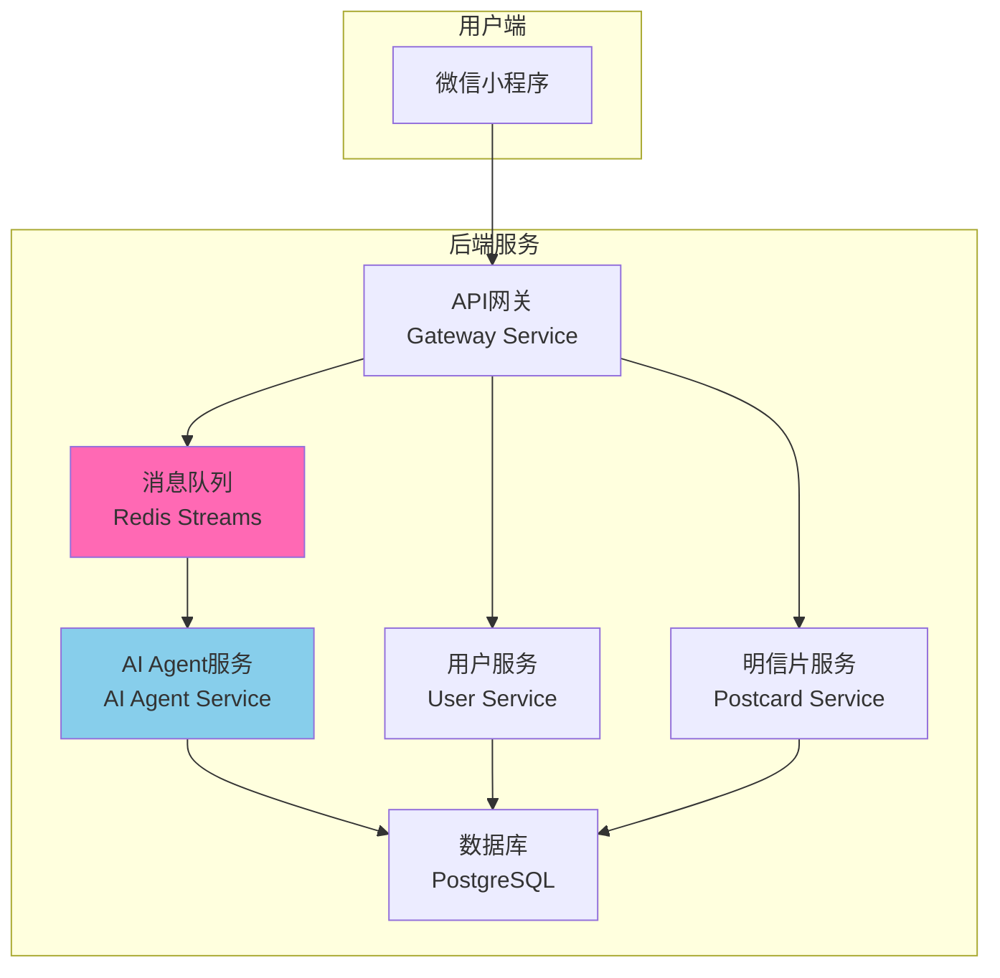

# 🎨 AI 明信片项目

> **智能化明信片生成系统** - 基于AI的情感化内容创作平台

一个创新的微服务架构项目，让AI不仅生成内容，更充当"前端工程师"，编写可交互、带动画的HTML/CSS/JS代码，生成在微信小程序web-view中渲染的动态明信片。

## ✨ 项目亮点

### 🎯 核心创新
- **AI前端工程师**：首创AI生成完整的HTML/CSS/JS交互代码
- **环境感知智能**：基于实时位置/天气/热点的个性化内容生成  
- **异步工作流架构**：高并发、高可用的分布式系统设计
- **微信小程序集成**：无缝的移动端用户体验

### 📊 技术特性
- **微服务架构**：Gateway + User/Postcard/AI-Agent Services
- **容器化部署**：Docker + Docker Compose，支持开发和生产环境
- **数据持久化**：PostgreSQL + Redis，支持消息队列和缓存
- **AI工作流**：概念生成 → 文案生成 → 图片生成 → **前端代码生成**
- **智能配额管理**：用户每日生成限制和配额恢复机制

## 🏗️ 系统架构



### 微服务组件

| 服务 | 端口 | 功能 | 技术栈 |
|------|------|------|--------|
| Gateway Service | 8083 | API网关、请求路由 | Python/FastAPI |
| User Service | 8081 | 用户认证、管理 | Python/FastAPI |
| Postcard Service | 8082 | 明信片数据管理 | Python/FastAPI |
| AI Agent Service | 8080 | AI工作流编排 | Python/FastAPI + Node.js |
| AI Agent Worker | - | 异步任务处理 | Python |
| PostgreSQL | 5432 | 主数据库 | PostgreSQL 15 |
| Redis | 6379 | 缓存+消息队列 | Redis 7 |
| Nginx | 80/443 | 反向代理 | Nginx (生产环境) |

## 🚀 快速开始

### 环境要求

- **Docker** >= 20.10
- **Docker Compose** >= 2.0
- **操作系统**：Linux, macOS, Windows (WSL2)
- **内存**：推荐 8GB+
- **磁盘空间**：5GB+

### 🎯 统一部署（推荐）

项目已经重构为**统一架构**：一套镜像，简单高效，开发生产完全一致！

#### 1. 克隆和准备
```bash
git clone https://github.com/your-org/ai-postcard.git
cd ai-postcard

# 复制环境配置
cp .env.example .env
# 编辑 .env 文件，填入必要的API密钥
```

#### 2. 一键启动（推荐）
```bash
# 方式一：完整初始化（首次使用推荐）
./scripts/run.sh init          # 创建目录、权限设置、启动数据库、初始化

# 方式二：直接启动所有服务（会自动构建镜像）
./scripts/run.sh up all        # 基础镜像 + 服务镜像 + 启动容器

# 方式三：分步启动
./scripts/run.sh build-base    # 1. 构建基础镜像
./scripts/run.sh up postgres redis    # 2. 启动数据库
./scripts/run.sh up gateway user postcard agent worker    # 3. 启动应用
```

#### 3. 验证部署
```bash
# 查看服务状态
./scripts/run.sh ps

# 查看日志
./scripts/run.sh logs                    # 所有日志
./scripts/run.sh logs ai-agent-service   # 特定服务
./scripts/run.sh logs ai-agent-service -f # 实时日志

# 健康检查
curl http://localhost:8083/health
```

### 📊 镜像构建说明

- **🔨 基础镜像** (`ai-postcard-base`): 首次运行自动构建，后续复用
- **🏗️ 服务镜像**: 每次 `up` 命令自动检查并重建（如果需要）
- **⚡ 构建顺序**: 基础镜像 → 各服务镜像 → 启动容器
- **🚀 缓存优化**: 基础镜像分层，大幅提升构建速度（60-70%提升）

### 💾 数据持久化

所有数据完全持久化到宿主机，容器删除数据不丢失：

```bash
data/
├── postgres/      # PostgreSQL数据 (UID:999)
├── redis/         # Redis数据 (UID:999)
└── ai-agent/static/ # AI生成的静态文件 (UID:1000)

logs/              # 实时同步的应用日志
├── gateway/
├── user/
├── postcard/
└── ai-agent/

backups/           # 备份目录
├── postgres/
└── redis/
```

## 📖 开发指南

### 项目结构
```
ai-postcard/
├── src/                          # 源代码目录
│   ├── gateway-service/          # API网关服务
│   ├── user-service/             # 用户管理服务  
│   ├── postcard-service/         # 明信片数据服务
│   ├── ai-agent-service/         # AI Agent核心服务
│   └── miniprogram/              # 微信小程序前端
├── scripts/                      # 管理脚本
│   ├── run.sh                   # 统一部署脚本
│   └── init-project.sh          # 项目初始化
├── docker/                       # Docker配置
│   └── Dockerfile.base          # 基础镜像
├── docs/                         # 项目文档
├── docker-compose.yml            # 统一服务编排
└── .env.example                  # 环境变量模板
```

### 🛠️ 脚本使用指南

**主要脚本：**
- `scripts/run.sh` - 统一部署脚本，支持所有环境和操作
- `scripts/init-project.sh` - 项目初始化脚本（仅首次使用）

#### 统一管理命令

**服务管理：**
```bash
./scripts/run.sh up all                 # 启动所有服务
./scripts/run.sh up gateway user        # 启动网关和用户服务
./scripts/run.sh up agent worker        # 启动AI服务和Worker
./scripts/run.sh down                   # 停止所有服务
./scripts/run.sh restart ai-agent-service # 重启特定服务
```

**环境初始化：**
```bash
./scripts/run.sh init                   # 完整环境初始化
./scripts/run.sh build-base             # 构建基础镜像
```

**调试工具：**
```bash
./scripts/run.sh ps                     # 查看服务状态
./scripts/run.sh logs                   # 查看所有日志
./scripts/run.sh logs ai-agent-service  # 查看特定服务日志
./scripts/run.sh logs ai-agent-service -f # 实时日志
./scripts/run.sh exec ai-agent-service bash # 进入容器调试
```

**测试支持：**
```bash
./scripts/run.sh up user-tests          # 运行用户服务测试
./scripts/run.sh up agent-tests         # 运行AI Agent测试
./scripts/run.sh up postcard-tests      # 运行明信片服务测试
```

**系统维护：**
```bash
./scripts/run.sh clean                  # 清理所有容器和数据
```

#### 可用服务配置

**Docker Compose Profiles：**
- `all` - 所有服务
- `gateway` - API网关
- `user` - 用户服务  
- `postcard` - 明信片服务
- `agent` - AI Agent服务
- `worker` - AI Agent Worker
- `postgres` - PostgreSQL数据库
- `redis` - Redis缓存

### API端点

| 端点 | 方法 | 功能 | 示例 |
|------|------|------|------|
| `/health` | GET | 健康检查 | `curl localhost:8083/health` |
| `/api/v1/users/login` | POST | 用户登录 | 微信小程序授权 |
| `/api/v1/postcards/create` | POST | 创建明信片 | 提交创作要求 |
| `/api/v1/postcards/status/{id}` | GET | 任务状态查询 | 轮询任务完成状态 |
| `/api/v1/postcards/{id}` | GET | 获取明信片 | 返回完整卡片数据 |

## 🔧 配置说明

### 核心环境变量

#### 数据库配置
```bash
DB_NAME=ai_postcard              # 数据库名称
DB_USER=postgres                 # 数据库用户  
DB_PASSWORD=your_secure_password # 数据库密码
DB_HOST=postgres                 # 数据库主机
DB_PORT=5432                     # 数据库端口
```

#### AI服务配置
```bash
AI_PROVIDER_TYPE=claude          # AI Provider类型
ANTHROPIC_AUTH_TOKEN=sk-xxx      # Claude API密钥
GEMINI_API_KEY=xxx               # Gemini API密钥
AI_AGENT_PUBLIC_URL=http://localhost:8080  # 公开访问地址
```

#### Redis配置  
```bash
REDIS_HOST=redis                 # Redis主机
REDIS_PORT=6379                  # Redis端口
REDIS_PASSWORD=your_redis_pass   # Redis密码
QUEUE_STREAM_NAME=postcard_tasks # 消息队列名称
QUEUE_CONSUMER_GROUP=ai_agent_workers # 消费者组
```

### 微信小程序配置
```bash
WECHAT_APP_ID=your_app_id        # 小程序AppID
WECHAT_APP_SECRET=your_secret    # 小程序AppSecret
```

## 📚 功能特性

### 🎯 AI工作流引擎
- **四步式生成流程**：概念 → 内容 → 图片 → 前端代码
- **智能编排器**：Orchestrator模式，支持步骤回滚和重试
- **多Provider支持**：Claude、Gemini等多AI模型集成
- **异步任务处理**：Redis Streams消息队列，支持高并发

### 🌍 环境感知系统
- **地理定位服务**：精确的位置获取和地址解析
- **天气信息集成**：实时天气数据获取
- **热点新闻服务**：基于地理位置的时事热点
- **智能缓存策略**：1000倍性能提升的缓存机制

### 📱 微信小程序前端
- **情绪输入界面**：创新的情绪罗盘交互设计
- **实时任务跟踪**：轮询机制显示AI生成进度
- **动态卡片渲染**：web-view中渲染AI生成的交互代码
- **历史记录管理**：记忆画廊功能
- **分享功能**：支持好友分享和朋友圈分享

### 🛡️ 配额管理系统
- **每日限制**：每用户每日最多生成2张明信片
- **智能恢复**：删除明信片释放当日配额
- **状态管理**：画布显示逻辑智能控制
- **用户友好**：清晰的配额提示和错误处理

## 🔒 安全特性

### 容器安全
- **非root用户**：所有容器使用非特权用户运行
- **多阶段构建**：优化镜像大小，减少攻击面
- **资源限制**：内存和CPU限制，防止资源滥用
- **健康检查**：自动故障检测和恢复

### 网络安全
- **Nginx反向代理**：SSL终止、限流、WAF防护
- **API限流**：基于IP的请求频率限制
- **CORS配置**：跨域访问控制
- **安全头部**：完整的HTTP安全头部设置

### 数据安全
- **敏感信息保护**：API密钥等敏感数据不记录日志
- **数据库加密**：支持数据库连接加密
- **数据备份**：自动化数据备份和恢复机制
- **审计日志**：详细的操作日志记录

## 📊 监控和运维

### 日志管理
```bash
# 查看实时日志
./scripts/run.sh logs ai-agent-service -f
./scripts/run.sh logs gateway-service -f

# 日志文件位置
./logs/gateway/         # 网关服务日志
./logs/user/           # 用户服务日志
./logs/postcard/       # 明信片服务日志
./logs/ai-agent/       # AI服务日志
```

### 性能监控
```bash
# 系统资源使用
./scripts/run.sh ps

# 容器状态监控
docker stats --no-stream
```

### 数据库管理
```bash
# 连接数据库
./scripts/run.sh exec postgres psql -U postgres -d ai_postcard

# 清理过期数据
./scripts/run.sh exec postgres psql -c "SELECT cleanup_expired_quotas();"
```

## 🐛 故障排除

### 常见问题

#### 1. 容器权限问题
```bash
# 症状：日志显示权限拒绝
# 解决：重新构建镜像
./scripts/run.sh down
./scripts/run.sh build-base
./scripts/run.sh up all
```

#### 2. 数据库连接失败
```bash  
# 检查数据库状态
./scripts/run.sh exec postgres pg_isready

# 重置数据库
./scripts/run.sh down
docker volume rm ai-postcard_postgres_data
./scripts/run.sh init
```

#### 3. Redis队列阻塞
```bash
# 手动清理队列（进入Redis容器）
./scripts/run.sh exec redis redis-cli -a "$REDIS_PASSWORD" XTRIM postcard_tasks MAXLEN 0
```

#### 4. AI服务响应超时
```bash
# 检查AI Agent日志
./scripts/run.sh logs ai-agent-service -f

# 重启AI服务
./scripts/run.sh restart ai-agent-service
```

### 日志分析
```bash
# 查找错误日志
grep -r "ERROR" ./logs/

# 分析访问模式
tail -f ./logs/nginx/access.log | grep "POST /api"

# 监控数据库慢查询
sh scripts/prod.sh exec postgres psql -c "SELECT * FROM pg_stat_statements ORDER BY total_time DESC LIMIT 10;"
```

## 🤝 开发贡献

### 代码规范
- 遵循项目的编码规范（详见 `CLAUDE.md`）
- 确保所有测试通过
- 编写有意义的提交消息

### 开发流程
1. Fork项目并创建功能分支
2. 开发新功能或修复问题
3. 添加相应的测试用例
4. 提交Pull Request并详细描述更改

### 测试
```bash
# AI Agent服务测试
./scripts/run.sh exec ai-agent-service pytest

# 用户服务测试  
./scripts/run.sh exec user-service pytest

# 明信片服务测试
./scripts/run.sh exec postcard-service pytest
```

## 📄 许可证

本项目采用 MIT 许可证 - 详见 [LICENSE](LICENSE) 文件

## 📞 支持与联系

- **文档**：[项目文档](docs/)
- **问题报告**：[GitHub Issues](https://github.com/your-org/ai-postcard/issues)
- **讨论**：[GitHub Discussions](https://github.com/your-org/ai-postcard/discussions)

---

<div align="center">

**🎨 让AI成为你的专属前端工程师，创造独一无二的情感明信片！**

Made with ❤️ by AI Postcard Team

</div>