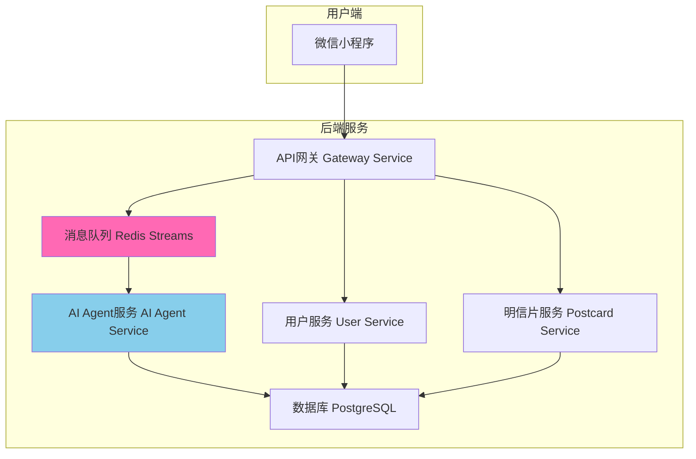

# 🎨 AI 明信片项目

智能化明信片生成系统：AI 不只是写文案与图片，更充当“前端工程师”，自动生成可交互的 HTML/CSS/JS，在微信小程序 web-view 中动态呈现。

## 🏗️ 架构概览



## 🚀 快速开始

1) 准备环境
```bash
cp .env.example .env
```

2) 初始化（首次必跑）
```bash
./scripts/run.sh init
```

3) 一键启动（自动构建并启动所有服务）
```bash
./scripts/run.sh up all
```

4) 基本验证
```bash
curl http://localhost:8083/health
```

常用命令
```bash
./scripts/run.sh ps                         # 查看服务状态
./scripts/run.sh logs gateway-service -f    # 查看实时日志
./scripts/run.sh down                       # 停止所有服务
```

依赖变更（requirements.txt 改动）
```bash
docker compose build user-service && docker compose up -d user-service
```

## 🧪 API 快速验证（经由网关 8083）

- 登录（开发态示例）
```bash
curl -s -X POST http://localhost:8083/api/v1/miniprogram/auth/login \
  -H 'Content-Type: application/json' \
  -d '{"code":"test_cli","userInfo":{"nickName":"Dev","avatarUrl":"","gender":0}}'
```

- 创建明信片（携带 Authorization）
```bash
curl -s -X POST http://localhost:8083/api/v1/miniprogram/postcards/create \
  -H "Authorization: Bearer <token>" -H 'Content-Type: application/json' \
  -d '{"mood":"开心","style":"梵高","theme":"庆祝","context":{"location":"上海","weather":"晴"}}'
```

- 任务状态查询
```bash
curl -s http://localhost:8083/api/v1/miniprogram/postcards/status/<task_id> \
  -H "Authorization: Bearer <token>"
```

## ✨ 核心功能

- **AI 四步工作流**：概念 → 文案 → 图片 → 前端代码（动态交互）
- **环境感知**：位置 / 天气 / 热点聚合与缓存
- **配额与一致性**：每日限次、失败回收、删除释放当日名额
- **安全与可观测**：JWT、RBAC、限流、审计日志与监控（网关透传状态码）
- **小程序体验**：登录与状态同步、401 熔断与刷新节流、权限引导

## 🧰 开发与容器

- 代码热重载：容器内 `uvicorn --reload`，修改 `src/<service>/app` 即时生效
- 依赖更新：修改 `requirements.txt` 后需重建镜像并重启对应服务
- 数据与日志：
```bash
data/   # PostgreSQL / Redis / AI静态产物
logs/   # gateway / user / postcard / ai-agent
```

## 📁 目录结构（简）

```
ai-postcard/
├── src/
│   ├── gateway-service/  │ 8083
│   ├── user-service/     │ 8081
│   ├── postcard-service/ │ 8082
│   ├── ai-agent-service/ │ 8080（含 worker）
│   └── miniprogram/      │ 微信小程序
├── scripts/              │ run.sh 等
├── docs/                 │ 设计与验证文档
├── data/                 │ 数据持久化
└── logs/                 │ 服务日志
```

## 📄 许可证与支持

- 许可证：MIT（见 `LICENSE`）
- 文档与问题反馈：`docs/` 与项目 Issues
