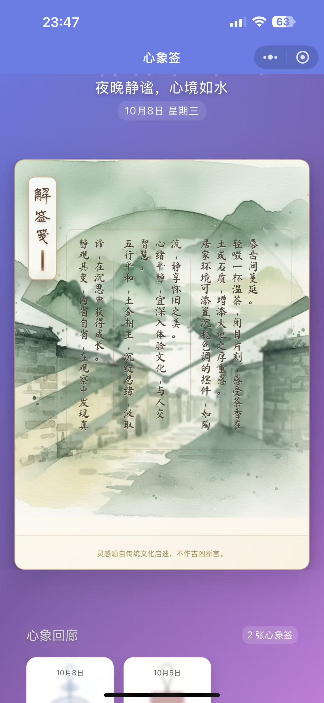

# 前言

这是一个完全由AI🤖编码的项目，我和cursor、claude code，还有codex也帮一点小忙，关于cursor的规则非常有参考价值，这是一个从0到1的完完全全由AI闭环完成的项目，从设计、开发、测试，AI几乎做了所有的事情，当然，没有我，它也不可能做到！其中有很多心得，欢迎交流🌻

# 🔮 AI 心象签项目

智能化心象签生成系统：将心情映射为自然意象与传统挂件，通过 AI 工作流在微信小程序中生成可翻面的心象签体验。用户绘制情绪墨迹、回答心境问答，系统异步完成概念生成、文案创作、图像渲染与结构化内容输出，最终呈现传统挂件式的求签体验，支持 3D 翻面交互与竖排书法美学。




## 🏗️ 架构概览


## 🚀 快速开始

1) 准备环境
```bash
cp .env.example .env
```

2) 初始化（首次必跑）
```bash
./scripts/run.sh init
```

3) 一键启动（自动构建并启动所有服务）
```bash
./scripts/run.sh up all
```

4) 基本验证
```bash
curl http://localhost:8083/health
```

常用命令
```bash
./scripts/run.sh ps                         # 查看服务状态
./scripts/run.sh logs gateway-service -f    # 查看实时日志
./scripts/run.sh down                       # 停止所有服务
```

依赖变更（requirements.txt 改动）
```bash
docker compose build user-service && docker compose up -d user-service
```

## 🧪 API 快速验证（经由网关 8083）

- 登录（开发态示例）
```bash
curl -s -X POST http://localhost:8083/api/v1/miniprogram/auth/login \
  -H 'Content-Type: application/json' \
  -d '{"code":"test_cli","userInfo":{"nickName":"Dev","avatarUrl":"","gender":0}}'
```

- 创建心象签（携带 Authorization）
```bash
curl -s -X POST http://localhost:8083/api/v1/miniprogram/postcards/create \
  -H "Authorization: Bearer <token>" -H 'Content-Type: application/json' \
  -d '{"user_input":"今日心情很好","drawing_data":{"trajectory":[],"analysis":{}},"context":{"location":"上海","weather":"晴"}}'
```

- 任务状态查询
```bash
curl -s http://localhost:8083/api/v1/miniprogram/postcards/status/<task_id> \
  -H "Authorization: Bearer <token>"
```

## ✨ 核心功能

### 🤖 AI 工作流（4 步生成）
1. **概念生成**：融合墨迹分析、问答洞察与环境信息，生成自然意象
2. **文案创作**：生成祝福语、笔触解读、生活指引等传统签笺内容
3. **图像渲染**：调用 Gemini/META 生成 AI 背景图，支持占位图兜底
4. **结构化输出**：完整的心象签数据（含 `charm_identity`、`oracle_manifest` 等）

### 🎨 智能签体推荐系统
- **18 款传统挂件**：八卦锦囊、莲花圆牌、如意结、古钱符等，每款独立视觉风格
- **10 维特征矩阵**：通过加权余弦相似度匹配用户心境与签体特征
- **曝光均衡机制**：Redis 追踪历史曝光，避免重复推荐，确保体验多样性

### 📱 小程序体验
- **3D 翻面挂件**：点击翻转查看正面签体与背面解签内容，支持动画过渡
- **竖排书法布局**：背面采用传统竖排文字 + 书法字体（黄草、方正启体等）
- **合规分享功能**（✨ 2025-10-08 优化）：
  - 好友分享：根据翻面状态自动选择正面签体图或背面 AI 背景图
  - 朋友圈分享：单张图片分享，符合微信 1:1 展示规范
  - 保存拼接图：详情页支持生成正反面左右拼接图（1200x600），保存到相册后可手动发朋友圈
- **资源缓存优化**：签体图片、字体文件本地缓存，弱网环境下依然流畅
- **字体全局预载**：App 启动阶段预载书法字体，首页与详情页字体同步生效

### 🔧 后端架构
- **微服务解耦**：Gateway (8083) + User (8081) + Postcard (8082) + AI Agent (8080)
- **异步任务队列**：Redis Streams 解耦请求与生成，Worker 消费 `postcard_tasks` 队列
- **配额与一致性**：每日生成限次、失败自动回收配额、删除释放当日名额
- **安全与审计**：JWT + RBAC 鉴权、内部服务 Token 校验、操作审计日志
- **可观测性**：网关透传状态码、结构化日志、服务健康检查

### 🌍 环境感知增强
- **位置服务**：高德地图 API 获取用户当前位置（城市/区域）
- **天气服务**：和风天气 API 获取实时天气与温度
- **热点聚合**：百度热榜 + 微博热搜 + Google Trends 综合热点话题
- **Redis 缓存**：环境数据 15 分钟缓存，减少外部 API 调用

## 🧰 开发与容器

- 代码热重载：容器内 `uvicorn --reload`，修改 `src/<service>/app` 即时生效
- 依赖更新：修改 `requirements.txt` 后需重建镜像并重启对应服务
- 数据与日志：
```bash
data/   # PostgreSQL / Redis / AI静态产物
logs/   # gateway / user / postcard / ai-agent
```

## 📁 目录结构（简）

```
ai-postcard/
├── src/
│   ├── gateway-service/     # API 网关 (FastAPI, 8083)
│   ├── user-service/        # 用户认证服务 (FastAPI, 8081)
│   ├── postcard-service/    # 心象签服务 (FastAPI, 8082)
│   ├── ai-agent-service/    # AI Agent + Worker (FastAPI, 8080)
│   └── miniprogram/         # 微信小程序前端
│       ├── components/      # 组件（hanging-charm 挂件等）
│       ├── pages/           # 页面（index 首页、postcard 详情等）
│       └── utils/           # 工具（auth、cache、polling 等）
├── resources/               # 静态资源
│   ├── 签体/                # 18 款传统挂件 PNG + charm-config.json
│   └── 题库/                # 心境速测问答题库
├── scripts/                 # 部署脚本（run.sh 等）
├── docs/                    # 设计文档与验证记录
│   ├── design/              # 系统架构、容器化、挂件体验等设计文档
│   └── tests/validation/    # 测试验证记录（最新：2025-10-08）
├── data/                    # 数据持久化（PostgreSQL、Redis）
└── logs/                    # 服务日志

关键文件：
- CLAUDE.md：Claude Code 项目开发指南（核心规范）
- CHANGELOG.md：版本变更记录（最新：2025-10-08 分享功能优化）
- .env.example：环境变量模板（需复制为 .env 并配置）
```

## 📚 技术栈

### 后端
- **FastAPI**：异步 Web 框架，支持自动 API 文档
- **PostgreSQL**：关系型数据库，存储用户与心象签数据
- **Redis Streams**：消息队列，异步任务编排
- **Docker Compose**：容器编排，支持 profiles 灵活管理服务

### AI 集成
- **Anthropic Claude**：主力 AI 模型，负责概念生成、文案创作与结构化输出
- **Google Gemini**：图像生成备选通道
- **Meta AI**：图像生成备选通道

### 前端
- **微信小程序原生框架**：WXML + WXSS + JavaScript
- **Canvas 2D API**：图片拼接与导出
- **书法字体**：黄草、方正启体等传统字体

### 外部服务
- **高德地图 API**：位置服务
- **和风天气 API**：天气服务
- **百度热榜 + 微博热搜 + Google Trends**：热点聚合

## 📖 关键文档索引

- [系统架构设计](docs/design/00-system-architecture.md) - 最新架构与异步流程
- [容器化与开发环境](docs/design/10-containerization-and-dev-environment.md) - Docker Compose profiles 详解
- [挂件体验设计](docs/design/19-hanging-charm-experience.md) - 3D 翻面与竖排布局规范
- [分享功能设计](docs/design/25-miniprogram-sharing-canvas-plan.md) - Canvas 拼接图技术方案
- [分享策略调整](docs/design/26-share-strategy-adjustment.md) - 2025-10-08 合规改造完整记录
- [最新验证报告](docs/tests/validation/2025-09-24-heart-oracle-comprehensive-fixes.md) - 全链路测试验证

## 🔄 版本历史亮点

- **2025-10-08**：分享功能合规改造，Canvas 拼接图路径修复，朋友圈单图策略，保存拼接图功能修复
- **2025-10-06**：卡片图片缓存修复，避免轮询覆盖已生成图片
- **2025-10-05**：挂件字体全局预载，首页与详情页字体同步
- **2025-09-30**：签体推荐算法系统上线，10 维特征 + 曝光均衡
- **2025-09-30**：心境速测题库优化，90 题分组，首屏精选 25 题
- **2025-09-10**：小程序前端增强，3D 翻面挂件 + 竖排书法布局
- **2025-09-01**：微服务架构完成，Gateway + User/Postcard/AI-Agent 拆分

## 📄 许可证与支持

- **许可证**：MIT（见 [LICENSE](LICENSE)）
- **问题反馈**：项目 Issues 或参考 `docs/` 文档
- **开发指南**：详见 [CLAUDE.md](CLAUDE.md)（必读）
