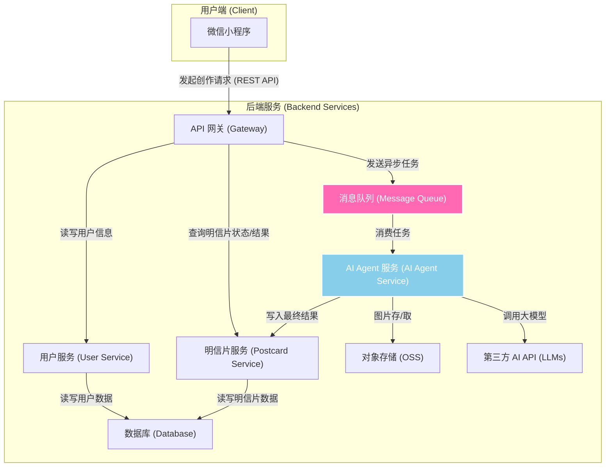
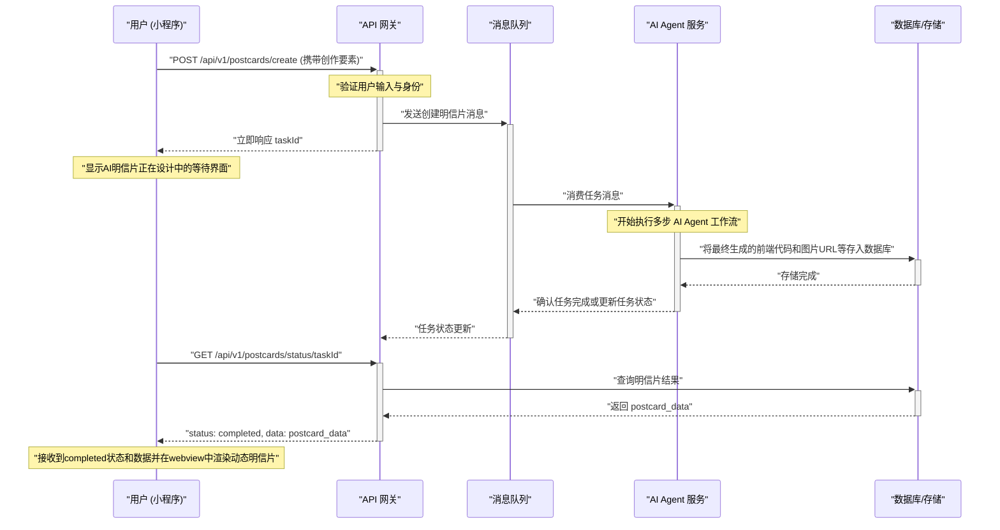

# 系统架构设计 V2

## 1. 核心设计思想

- **微服务化 (Microservices)**: 将整个后端系统拆分为多个独立、可单独部署和扩展的微服务。
- **前后端分离**: 小程序前端与后端服务完全分离，通过 API 网关进行通信。
- **异步化与事件驱动**: 针对 AI 内容生成等耗时操作，采用**消息队列**进行解耦，实现异步任务处理，优化用户体验。
- **AI Agent 核心**: 将多步骤的 AI 调用封装在专用的 Agent 服务中，实现复杂的任务编排和工具调用。

## 2. 系统架构图 (V2 - 异步流程)

## 3. 核心交互流程：异步明信片生成

为了避免 AI 生成过程（通常耗时 5-30 秒）导致前端长时间等待，我们采用异步任务模型：

## 4. 服务模块职责

### 4.1. API 网关 (Gateway)
- **职责**: 所有外部请求的统一入口，负责请求路由、用户认证、速率限制和初步的请求校验。
- **技术选型**: Spring Cloud Gateway / Kong / Nginx

### 4.2. 用户服务 (User Service)
- **职责**: 管理用户信息，包括登录、注册、个人资料等。
- **技术选型**: Spring Boot, gRPC/REST

### 4.3. 明信片服务 (Postcard Service)
- **职责**: 管理明信片的核心数据，包括AI生成的前端代码、图片URL、文案等。提供数据的增删改查接口。
- **技术选型**: Spring Boot, gRPC/REST

### 4.4. AI Agent 服务 (AI Agent Service)
- **职责**: **项目核心**。消费来自消息队列的任务，通过内置的编排器 (Orchestrator) 和工具集 (ToolBox)，按步骤调用第三方 AI API，完成从概念生成到最终前端代码输出的完整流程。
- **技术选型**: Python (LangChain/LlamaIndex), FastAPI/gRPC

### 4.5. 消息队列 (Message Queue)
- **职责**: 服务间解耦，作为异步任务的缓冲池。
- **技术选型**: RabbitMQ / RocketMQ / Kafka

### 4.6. 数据库 (Database)
- **职责**: 持久化存储用户和明信片数据。
- **技术选型**: PostgreSQL / MySQL

### 4.7. 对象存储 (Object Storage Service)
- **职责**: 存储 AI 生成的图片等静态资源。
- **技术选型**: MinIO / Aliyun OSS / AWS S3 