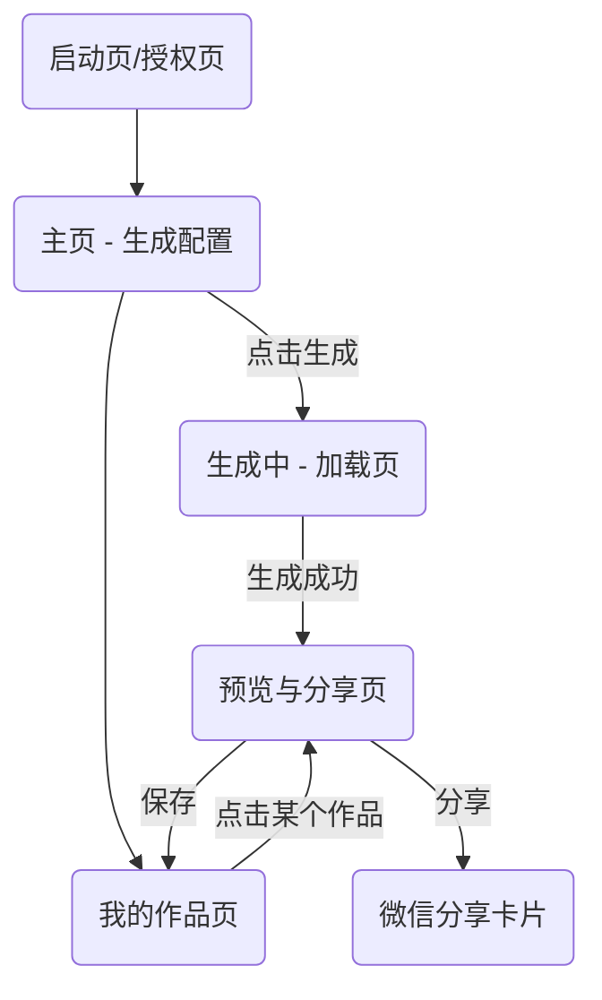

# 01 - 前端小程序设计 (Frontend Miniprogram)

本文档详细描述了 "AI 明信片" 微信小程序的前端设计，包括页面结构、核心组件、状态管理和 API 通信。

## 1. 页面结构 (Pages)

小程序将由以下几个核心页面组成：

| 页面 | 路径 | 功能描述 |
| :--- | :--- | :--- |
| **授权页** | `pages/auth/index` | 检查用户登录态，引导用户进行微信授权。 |
| **主页/生成页** | `pages/home/index` | 核心页面。用户在此输入信息、选择风格主题，并发起生成请求。 |
| **加载页** | `pages/loading/index` | 等待后端处理时展示，提供友好的动画和提示，缓解用户等待焦虑。 |
| **预览与分享页**| `pages/postcard/index` | 展示由 `web-view` 渲染的动态明信片，并提供分享、保存和重新生成选项。 |
| **我的作品页** | `pages/gallery/index` | 以列表或瀑布流形式展示用户所有已生成的明信片。 |

## 2. 核心组件设计 (Components)

为了代码复用和维护性，我们将构建以下核心自定义组件。

### 2.1. `info-form` (信息输入组件)
- **位置**: `pages/home/index`
- **功能**: 提供表单让用户输入心情、职业等个性化信息。
- **属性 (Properties)**: `initialData` (用于编辑或重新生成)。
- **事件 (Events)**: `submit` (当用户提交表单时触发，返回表单数据)。

### 2.2. `style-selector` (风格/主题选择器)
- **位置**: `pages/home/index`
- **功能**: 以卡片轮播或网格布局，让用户直观地选择艺术风格和内容主题。
- **属性 (Properties)**: `options` (包含风格/主题名称、预览图、描述的数组)。
- **事件 (Events)**: `change` (当用户选择变更时触发，返回选择的 `style` 和 `theme`)。

### 2.3. `postcard-renderer` (明信片渲染器)
- **位置**: `pages/postcard/index`
- **功能**: 内部封装 `web-view` 组件，负责接收 AI 生成的 HTML 代码并安全地渲染。
- **属性 (Properties)**: `htmlContent` (待渲染的 HTML 字符串)。
- **核心逻辑**:
    - 将接收到的 `htmlContent` 写入一个临时的 HTML 文件中，或通过 data URI 的方式传递给 `web-view` 的 `src` 属性。
    - 需要处理 `web-view` 与小程序之间的通信，例如，如果 HTML 内部有可交互元素需要通知小程序。

## 3. 状态管理 (State Management)

我们将采用小程序的 `mobx` 或类似的全局状态管理库，来管理跨页面的共享数据。

- **Store**: `userStore`
  - **State**: `userInfo`, `token`, `isLoggedIn`
  - **Actions**: `login()`, `logout()`, `updateUserInfo()`

- **Store**: `postcardStore`
  - **State**: `generationParams` (生成参数), `currentPostcard` (当前明信片数据), `history` (历史列表)
  - **Actions**: `setParams()`, `generate()`, `saveToHistory()`

## 4. API 通信 (API Interaction)

所有对后端的请求都将通过一个封装好的 `apiService` 模块。

- **基地址**: `https://api.yourdomain.com/v1` (通过 API 网关)
- **通用头部**: 所有请求都将携带 `Authorization: Bearer <token>`。

### 接口列表

| HTTP 方法 | 路径 | 描述 | 所属服务 |
| :--- | :--- | :--- | :--- |
| `POST` | `/auth/login` | 使用微信 `code` 换取 `token` 和用户信息 | 用户服务 |
| `GET` | `/users/me` | 获取当前用户的详细信息 | 用户服务 |
| `PUT` | `/users/me` | 更新当前用户信息 | 用户服务 |
| `POST`| `/postcards/generate` | **核心接口**。发起明信片生成请求 | AI 代理服务 |
| `GET` | `/postcards` | 获取我的明信片历史列表 | 明信片服务 |
| `GET` | `/postcards/:id`| 获取单张明信片的详细数据 | 明信片服务 | 