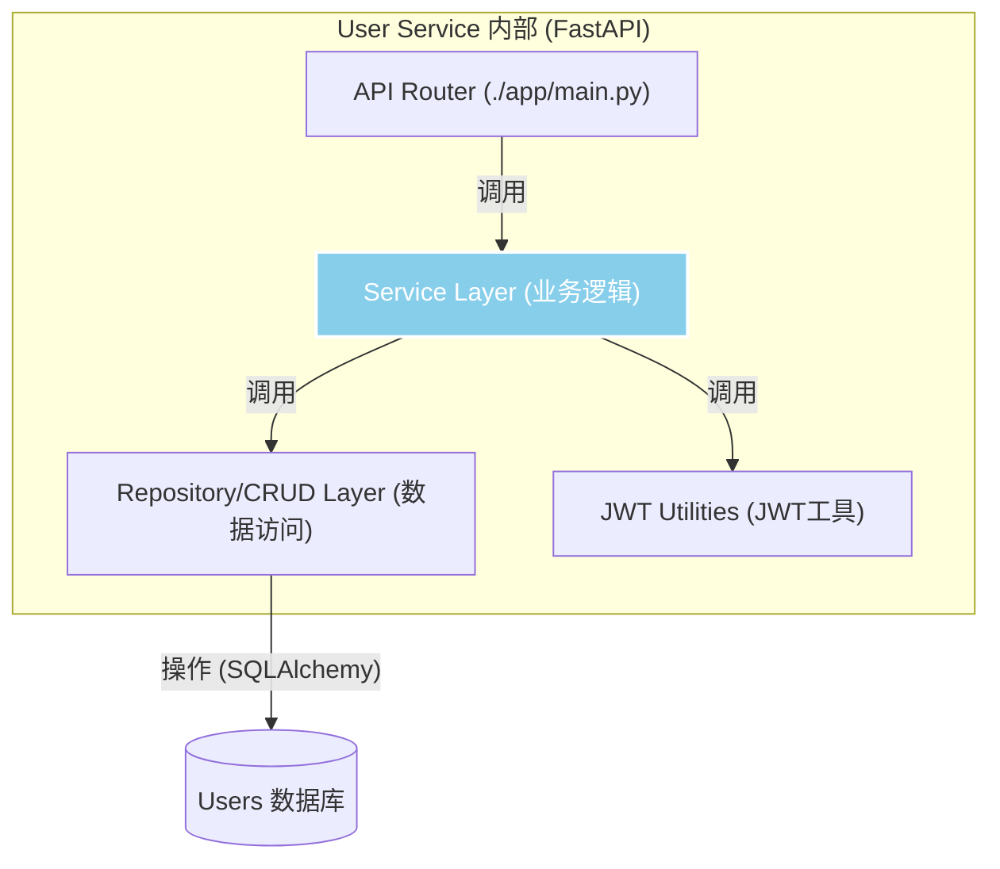

# 用户服务设计 (User Service)

## 1. 核心职责

用户服务是系统中唯一负责管理用户信息的模块。其核心职责是：

- **用户身份管理**: 处理用户的注册和登录流程，特别是与微信开放平台的 `openid` 绑定。
- **会话管理**: 生成并验证用于 API 认证的 `JWT` (JSON Web Token)。
- **用户信息存储**: 持久化存储用户的基本信息，如昵称、头像等。
- **提供用户信息查询接口**: 为其他内部服务提供根据 `user_id` 查询用户详细信息的能力。

## 2. 数据模型 (Data Model)

用户服务将维护 `Users` 表的结构，与 PRD 和系统设计保持一致。

- **`Users` Table**
  - `user_id` (BIGINT, Primary Key, Auto-increment)
  - `open_id` (VARCHAR, Unique, Not Null): 微信用户唯一标识。
  - `nickname` (VARCHAR): 用户昵称。
  - `avatar_url` (VARCHAR): 用户头像 URL。
  - `created_at` (TIMESTAMP): 创建时间。
  - `updated_at` (TIMESTAMP): 最后更新时间。

## 3. 服务间接口 (Inter-Service API)

为了实现服务解耦，用户服务将通过 gRPC (或 RESTful API) 向其他内部服务暴露接口。

- **`rpc GetUserById (GetUserRequest) returns (UserResponse)`**
  - **描述**: 根据 `user_id` 查询单个用户的详细信息。
  - **请求**: `{ user_id: 123 }`
  - **响应**: `{ user_id: 123, nickname: "...", avatar_url: "..." }`
  - **调用方**: API 网关（在需要时）、明信片服务等。

- **`rpc Login (LoginRequest) returns (LoginResponse)`**
  - **描述**: 处理来自 API 网关的登录请求。接收微信 `code`，调用微信接口换取 `openid`，然后判断用户是新注册还是已存在，最终生成 `JWT`。
  - **请求**: `{ wx_code: "..." }`
  - **响应**: `{ token: "jwt_token_string", is_new_user: true/false }`
  - **调用方**: API 网关。

## 4. 内部模块设计

- **API Router**: 使用 FastAPI 的 `APIRouter` 定义和暴露 RESTful API 端点。
- **Service Layer**: 实现核心业务逻辑，如 `login_or_register`、`get_user_profile`。
- **Repository/CRUD Layer**: 数据访问层，使用 **SQLAlchemy ORM** 与数据库进行交互。
- **JWT Utilities**: 一个独立的工具模块，负责 `JWT` 的生成和解析。

## 5. 技术选型

- **框架**: **Python (FastAPI)**
- **数据库**: **PostgreSQL**
- **ORM**: **SQLAlchemy**
- **服务间通信**: **RESTful API** 