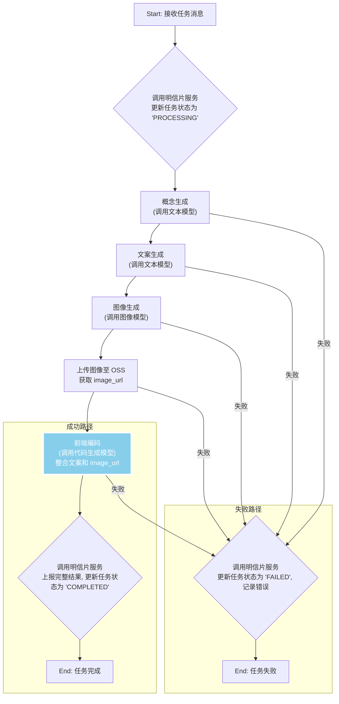
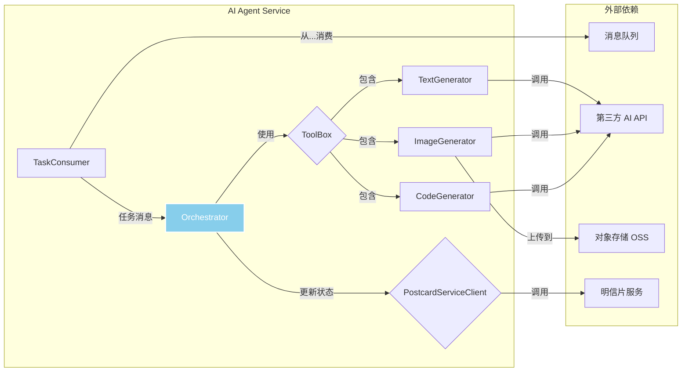

# AI Agent 服务设计 (AI Agent Service)

## 1. 核心职责

AI Agent 服务是整个项目的“创意大脑”和“执行引擎”。它是一个独立的、异步的 worker 服务，其核心职责是：

- **消费任务 (Consume Tasks)**: 持续监听消息队列，获取由 API 网关发布的新明信片创作任务。
- **任务编排 (Task Orchestration)**: 对于每一个任务，执行一个预定义的多步骤工作流（Workflow），按顺序调用各种 AI 工具。
- **工具调用 (Tool Calling)**: 与第三方 AI 服务（如文本生成、图像生成、代码生成模型）进行实际的 API 调用。
- **状态反馈 (State Feedback)**: 在任务执行的关键节点（开始、失败、成功），通过调用明信片服务的接口来更新任务状态。
- **结果上报 (Result Reporting)**: 任务成功后，将最终生成的 `frontend_code`、`image_url` 等完整数据打包，通过调用明信片服务的接口存入数据库。

## 2. 内部工作流 (Internal Workflow)

当 Agent 从消息队列消费一个任务后，将启动以下内部流程：

- **幂等性保证 (Idempotency)**: 在步骤 A 之后，B 步骤不仅仅是更新状态。它必须先查询任务当前状态。如果状态不是 `PENDING`，意味着任务可能已被其他 worker 实例消费，此时应直接丢弃该消息，避免重复执行。

## 3. 内部模块设计

- **`TaskConsumer`**: 任务消费者。负责连接消息队列，循环获取新任务，并将其交给 `Orchestrator` 处理。
- **`Orchestrator`**: **核心编排器**。实现上述的内部工作流，管理任务的生命周期，**处理重试和错误**，并按顺序调用 `ToolBox` 中的工具。
- **`ToolBox`**: 工具箱。一个包含所有可用 AI 工具的集合。
  - **`TextGenerator`**: 封装对文本生成模型 API 的调用。
  - **`ImageGenerator`**: 封装对图像生成模型 API 的调用，并负责将生成的图片上传到对象存储，**同时生成缩略图**。
  - **`CodeGenerator`**: 封装对代码生成模型 API 的调用。**这是最复杂的工具**，需要一个精巧的 `PromptManager` 来根据输入动态构建高质量的指令。
- **`PostcardServiceClient`**: 明信片服务的 gRPC/REST 客户端。用于在任务流各阶段向明信片服务更新任务状态和上报最终结果。

## 4. 关键技术：代码生成的 Prompt 设计

`CodeGenerator` 的成功与否高度依赖于其发送给 LLM 的 Prompt 质量。一个优秀的 Prompt 应该包含以下元素：

- **角色扮演**: `"你是一位精通 HTML, CSS, JavaScript 的创意前端工程师..."`
- **任务描述**: `"你的任务是为一张电子明信片编写一个独立的、动态的、可交互的前端页面..."`
- **上下文输入**:
  - `文案`: 将上一步生成的文案内容完整传入。
  - `图片 URL`: 将上一步上传的图片 URL 传入。
  - `风格和主题`: 传入用户选择的 `style` 和 `theme`。
- **严格的技术约束**:
  - `"必须将所有 HTML, CSS, JS 代码包含在一个文件中。"`
  - `"CSS 必须内联在 `<style>` 标签中，JS 必须内联在 `<script>` 标签中。"`
  - `"不允许使用任何外部依赖（如 CDN, npm 包）。"`
  - `"必须包含动画效果，例如使用 CSS Animation 或 Transition。"`
  - `"最终输出必须是一个完整的 HTML 字符串，不要包含任何解释性文字或 markdown 标记。"`

## 5. 健壮性设计 (Robustness)

### 5.1. 错误处理与重试策略

- **瞬时错误 (Transient Errors)**: 当调用外部 API 遇到网络超时、5xx 服务端错误等临时性问题时，`Orchestrator` 必须采取带**指数退避（Exponential Backoff）**的重试策略。例如，第一次失败后等1秒，第二次等2秒，第三次等4秒，最多重试3次。
- **永久错误 (Permanent Errors)**: 当遇到 `4xx` 客户端错误（如输入参数非法、API Key 无效）或重试耗尽后，应立即将任务标记为 `FAILED`，记录详细错误信息，并停止执行。

### 5.2. 成本与性能控制

- **全局超时**: 每个任务从开始执行到结束，必须有一个总的超时限制（如 2 分钟）。超时后，任务将被标记为 `FAILED`，以防止无限期的执行和资源占用。
- **工具级超时**: 对每次第三方 AI API 的调用，都必须设置一个合理的超时时间（如 30 秒）。
- **模型选择**: 在 `ToolBox` 内部可以根据任务的复杂度，动态选择不同成本和性能的 AI 模型。例如，"概念生成"步骤可以使用更快、更便宜的模型。

## 6. 技术选型

- **语言**: Python (强烈推荐，因为其拥有最丰富的 AI 生态)
- **核心框架**: LangChain / LlamaIndex (用于简化 Agent 和工具链的构建)
- **Web 服务 (可选)**: FastAPI (如果需要提供额外的管理接口)
- **消息队列客户端**: pika (for RabbitMQ)
- **服务间通信**: gRPC / HTTP (requests) 