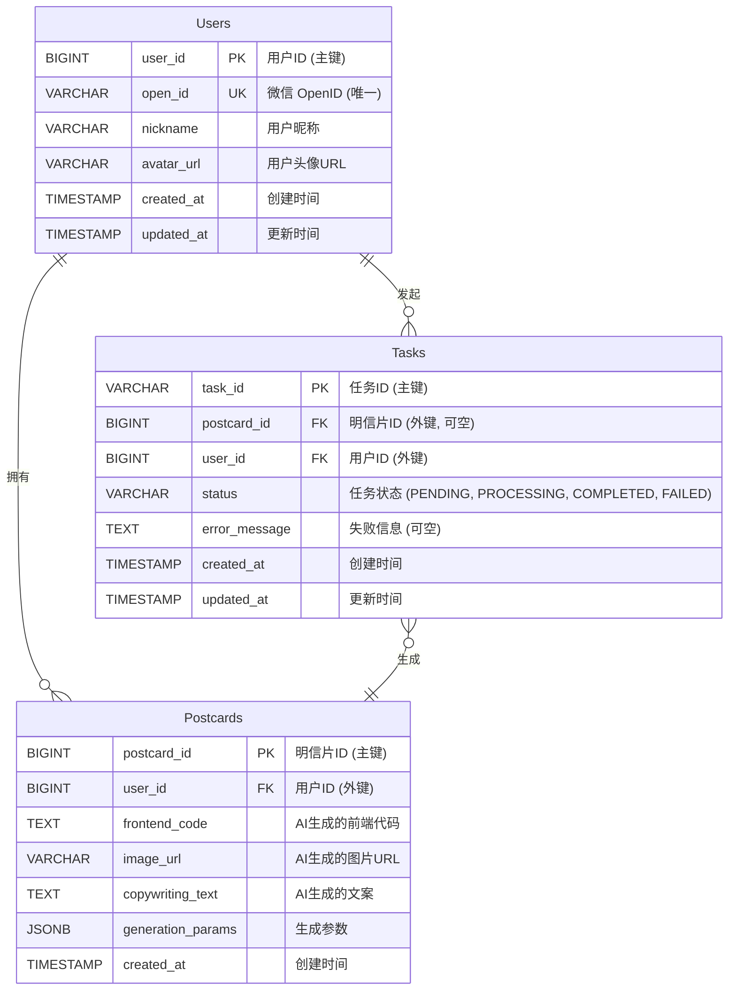

# 数据库 schema 设计 (Database Schema)

## 1. 概述

本文档定义了 "AI 明信片" 项目所使用的核心数据表的统一视图，并描绘了它们之间的关系。这是所有后端服务在数据库层面应遵循的唯一标准。

## 2. 实体关系图 (ER Diagram)

## 3. 表结构详述

### 3.1. `Users` - 用户表

存储所有已授权登录的用户信息。

- `user_id`: 用户的唯一标识，自增主键。
- `open_id`: 从微信平台获取的用户唯一 `openid`，用于登录和身份识别，必须是唯一的。
- `nickname`, `avatar_url`: 用户的微信昵称和头像。
- `created_at`, `updated_at`: 记录的创建和最后更新时间。
- **所属服务**: `user-service`

### 3.2. `Postcards` - 明信片表

存储由 AI 成功生成的每一张明信片的核心数据。

- `postcard_id`: 明信片的唯一标识，自增主键。
- `user_id`: 外键，关联到 `Users` 表，表明该明信片的创作者。
- `frontend_code`: 核心数据，存储由 AI Agent 生成的完整 HTML/CSS/JS 代码。
- `image_url`: AI 生成并上传到对象存储的图片 URL。
- `copywriting_text`: AI 生成的配套文案原文。
- `generation_params`: JSONB 类型，存储生成该明信片时的所有输入参数（如心情、风格、主题、地理位置等），便于问题排查和重新生成。
- **所属服务**: `postcard-service`

### 3.3. `Tasks` - 异步任务表

用于跟踪每一个明信片生成请求的生命周期。这张表是实现异步轮询机制的核心。

- `task_id`: 任务的唯一标识符，由客户端在发起请求时获得，并用于后续状态轮询。
- `user_id`: 外键，关联到 `Users` 表。这使得可以直接查询某个用户的所有任务，而无需通过 `Postcards` 表，对于跟踪进行中的任务尤其重要。
- `postcard_id`: 当任务成功完成后，这里会填入对应 `Postcards` 表的 ID。任务处理中或失败时为 `NULL`。
- `status`: 任务的当前状态，枚举值包括：
    - `PENDING`: 任务已提交，等待处理。
    - `PROCESSING`: AI Agent 正在处理任务。
    - `COMPLETED`: 任务成功，明信片已生成。
    - `FAILED`: 任务失败。
- `error_message`: 当 `status` 为 `FAILED` 时，记录详细的错误信息。
- **所属服务**: `postcard-service` 