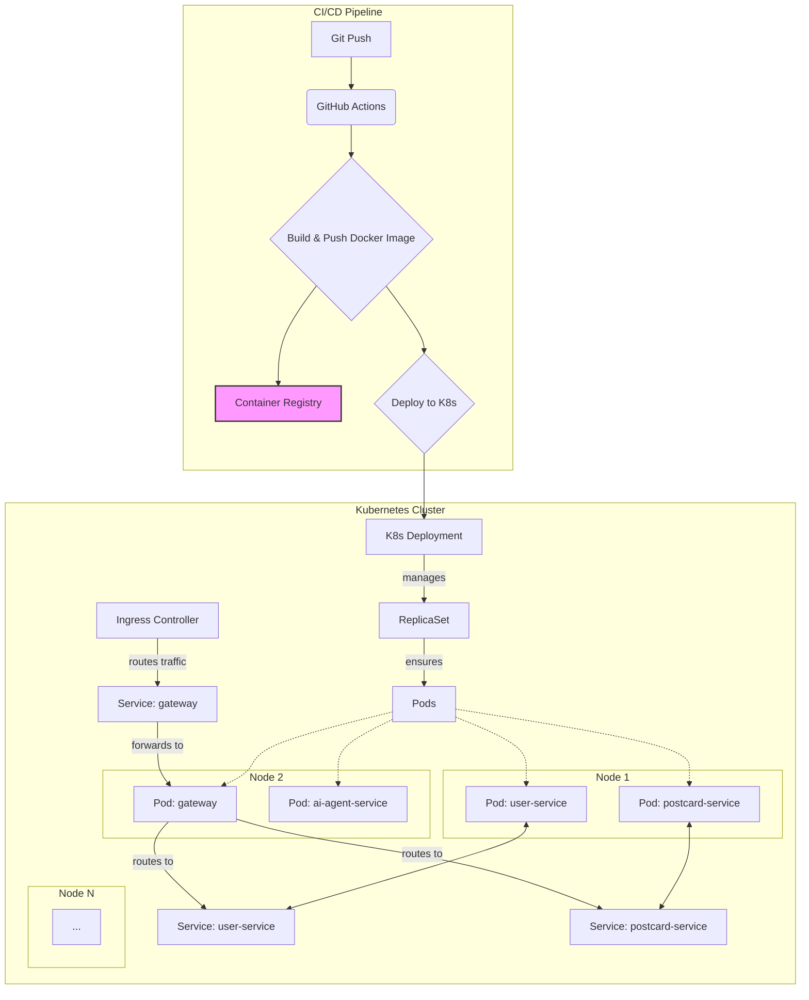

# 部署与 CI/CD 策略 (Deployment & CI/CD)

## 1. 核心理念

- **一切皆容器 (Everything in Containers)**: 所有微服务都将被打包成轻量、可移植的 Docker 镜像。
- **不可变基础设施 (Immutable Infrastructure)**: 任何部署的变更都通过构建和部署新的镜像来完成，而不是修改正在运行的容器。
- **自动化 (Automation)**: 从代码提交到生产部署的整个流程应最大限度地自动化，减少人工干预。

## 2. 部署架构

我们将采用 Kubernetes (K8s) 作为容器编排平台，以实现服务的弹性伸缩、故障自愈和高效管理。

### 2.1. Kubernetes 集群架构图



### 2.2. 组件说明

- **Container Registry**: 用于存储所有服务 Docker 镜像的仓库，如 Docker Hub, Google GCR, 或自建的 Harbor。
- **Ingress Controller**: K8s 集群的流量入口，负责将外部 HTTP/HTTPS 流量路由到正确的服务，通常使用 Nginx Ingress Controller。
- **Deployment**: K8s 的工作负载资源，定义了应用的期望状态（如副本数、镜像版本）。
- **Service**: 为一组 Pod 提供一个稳定的网络端点（IP 和 DNS），实现服务发现。
- **Pod**: K8s 中可部署的最小计算单元，通常包含一个或多个容器。

## 3. CI/CD 流水线 (Pipeline)

我们将使用 **GitHub Actions** 来构建我们的 CI/CD 流水线。每个微服务仓库中都将包含一个 `.github/workflows/ci.yml` 文件。

### 3.1. 流水线步骤

1.  **触发 (Trigger)**: 当代码被推送到 `main` 或 `develop` 分支，或创建新的 `release` 标签时触发。
2.  **代码检出 (Checkout)**: 拉取最新的代码。
3.  **设置环境 (Setup)**: 配置 Java/Python/Node.js 等所需环境。
4.  **依赖安装 (Install Dependencies)**: 执行 `mvn install` / `pip install` 等命令。
5.  **运行测试 (Run Tests)**: 执行单元测试和集成测试，确保代码质量。
6.  **构建镜像 (Build Docker Image)**: 使用 `Dockerfile` 构建服务的 Docker 镜像，并打上版本标签。
7.  **推送到镜像仓库 (Push to Registry)**: 将构建好的镜像推送到容器镜像仓库。
8.  **部署到 K8s (Deploy to Kubernetes)**:
    - **非生产环境**: 自动部署到 `staging` 环境。
    - **生产环境**: 当创建 `release` 标签时，触发手动审批步骤，审批通过后自动部署到 `production` 环境。部署操作通过 `kubectl apply -f k8s-deployment.yml` 实现。

### 3.2. Dockerfile 示例 (`user-service`)

```dockerfile
# 使用多阶段构建以减小镜像体积
FROM maven:3.8.4-openjdk-17 AS build
WORKDIR /app
COPY pom.xml .
COPY src ./src
RUN mvn clean package -DskipTests

FROM openjdk:17-jdk-slim
WORKDIR /app
COPY --from=build /app/target/user-service-*.jar ./app.jar
EXPOSE 8080
ENTRYPOINT ["java", "-jar", "app.jar"]
```

## 4. 环境管理

- **开发 (Development)**: 开发者在本地使用 Docker Compose 运行所需的服务。
- **测试 (Staging)**: 一个完整的、与生产环境配置一致的 K8s 环境，用于部署前的最后验证。
- **生产 (Production)**: 面向最终用户的 K8s 环境。

所有环境的配置（如数据库地址、API密钥）将通过 K8s 的 `ConfigMap` 和 `Secret` 进行管理，而不是硬编码在代码或镜像中。 