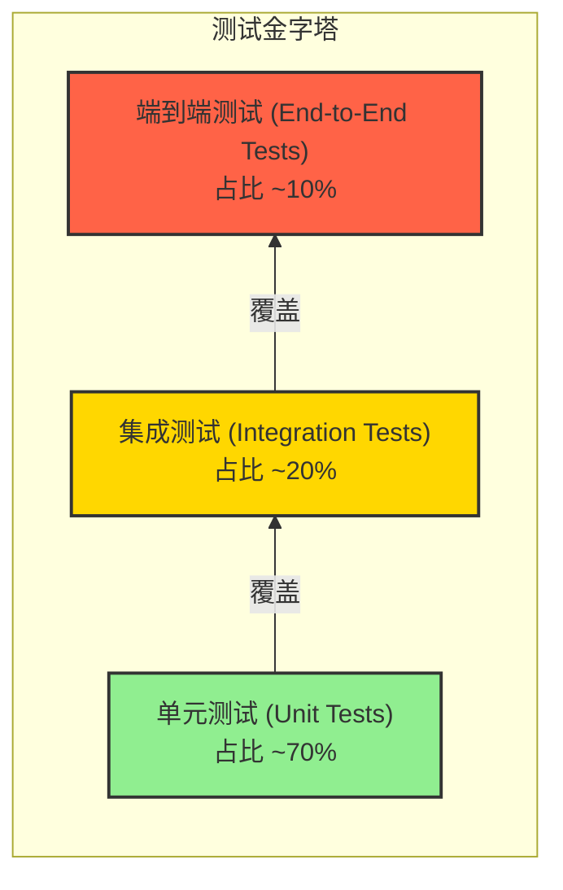

# 全面测试策略 (Testing Strategy)

## 1. 测试金字塔模型

我们将遵循经典的测试金字塔模型来组织我们的测试工作，确保在不同层级投入适当的精力，以实现成本和收益的最佳平衡。

## 2. 单元测试 (Unit Tests)

- **目标**: 验证单个类或函数（即“单元”）的行为是否符合预期。
- **范围**:
    - **User Service**: 验证 `UserService` 中的业务逻辑，如 `loginOrRegister`；验证 `JwtProvider` 生成和解析 token 的正确性。
    - **Postcard Service**: 验证 `PostcardService` 中对任务状态和明信片数据的处理逻辑。
    - **AI Agent Service**: 验证 `Orchestrator` 的工作流编排逻辑；验证 `ToolBox` 中各个工具的 `Prompt` 构建是否正确。
- **核心原则**:
    - **快速**: 运行速度快，可在每次代码提交前在本地完整运行。
    - **隔离**: 测试之间必须完全隔离。使用 Mocking 框架（如 Mockito for Java, `unittest.mock` for Python）来模拟外部依赖（如数据库、其他服务、第三方 API）。
- **技术栈**:
    - **Java (Spring Boot)**: JUnit 5, Mockito
    - **Python (FastAPI)**: PyTest, `unittest.mock`

## 3. 集成测试 (Integration Tests)

- **目标**: 验证多个组件或服务之间交互的正确性。
- **范围**:
    - **服务与数据库集成**: 验证服务的数据访问层（Repository）能否正确地与真实数据库进行交互。
    - **服务间通信**: 验证服务 A 是否能成功调用服务 B 的 API（REST 或 gRPC）并正确处理响应。
    - **服务与消息队列集成**: 验证 `AI Agent Service` 能否正确地消费来自消息队列的消息。
- **核心原则**:
    - **真实依赖**: 在这个层级，我们会使用真实的数据库、消息队列等基础设施，而不是 Mock。Testcontainers 是实现这一点的绝佳工具，它可以在 Docker 容器中启动这些依赖。
    - **有限范围**: 每个集成测试应关注一小部分服务的交互，而不是整个系统。
- **技术栈**:
    - **Java (Spring Boot)**: `@SpringBootTest`, Testcontainers
    - **Python (FastAPI)**: PyTest, Testcontainers

## 4. 端到端测试 (End-to-End / E2E Tests)

- **目标**: 模拟真实用户场景，从用户界面到后端服务再到数据库，贯穿整个系统，验证完整的业务流程是否正确。
- **范围**:
    - **核心用户流程**:
        1.  用户登录 -> 成功获取 token。
        2.  用户在主页填写信息 -> 点击生成 -> 轮询 -> 最终在预览页看到动态明信片。
        3.  用户在作品集页面能看到自己历史生成的明信片。
- **核心原则**:
    - **用户视角**: 测试脚本应模仿用户的实际操作。
    - **黑盒测试**: 将整个系统视为一个黑盒，只通过 UI 和公共 API 进行交互和断言。
    - **数量精简**: E2E 测试运行缓慢且维护成本高，因此只覆盖最关键的业务流程。
- **技术栈**:
    - **微信小程序自动化**: Minium (官方框架) 或其他支持小程序的自动化测试框架。
    - **测试环境**: E2E 测试应在专用的、完整的 `staging` 环境中运行。

## 5. 在 CI/CD 流水线中的集成

- **单元测试**: 在每次 `git push` 时自动运行。如果失败，则阻塞合并。
- **集成测试**: 在每次 `git push` 时自动运行。由于可能较慢，可以与单元测试并行。如果失败，同样阻塞合并。
- **端到端测试**: 通常在部署到 `staging` 环境后，按计划（如每晚）或手动触发运行。其结果作为是否可以发布到生产环境的重要参考。 