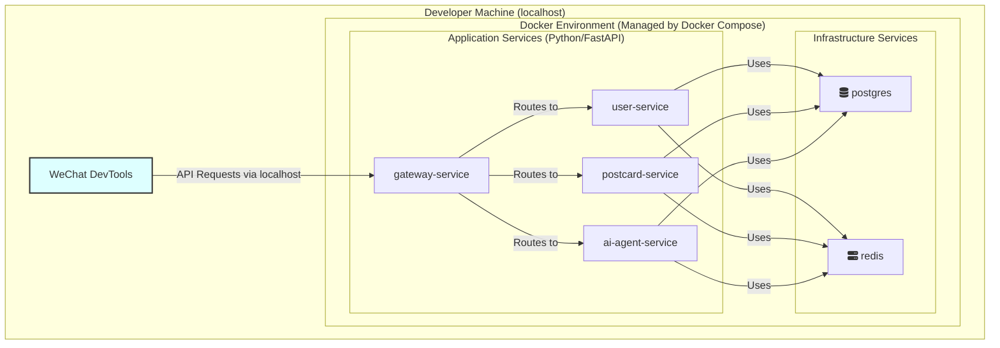

# 设计文档 10: 容器化与本地开发环境

> **文档状态**: 第三版
> **负责人**: AI 架构师
> **更新日期**: 2024-08-03

## 1. 概述与目标

为了确保开发、测试和生产环境的一致性，消除“在我机器上可以运行”的问题，并提升团队协作效率，本项目的所有后端服务都将采用容器化技术进行管理。本文档详细阐述了本地开发环境的容器化方案设计。

**核心目标:**

- **环境一致性**: 使用 Docker 确保所有环境（开发、测试、生产）的运行时高度一致。
- **服务隔离**: 每个服务在独立的容器中运行，拥有独立的依赖和配置，互不干扰。
- **按需启动**: 开发者通过单个脚本即可快速启动或停止所需的部分或完整的后端服务环境。
- **开发效率**: 支持代码热加载（Hot Reload），开发者修改代码后无需手动重启服务。
- **场景化支持**: 为单个服务提供多种启动模式（如正常运行、运行测试），以适应复杂的开发需求。

## 2. 整体容器化架构

我们将使用 `Docker` 对所有后端服务及依赖的中间件进行容器化，并利用 `Docker Compose` 在本地进行统一的服务编排和管理。

### 2.1. 架构图



## 3. Python 服务容器化设计 (统一蓝图)

所有后端服务（`gateway-service`, `user-service`, `postcard-service`, `ai-agent-service`）均采用统一的容器化策略。

### 3.1. 统一技术栈
- **语言**: Python 3.11
- **框架**: FastAPI
- **服务器**: Uvicorn

### 3.2. 统一 Dockerfile 设计

每个服务都将包含 `Dockerfile`（用于生产）和 `Dockerfile.dev`（用于开发）。

#### `Dockerfile.dev` (开发环境)
这是本地开发的核心。它的设计旨在最大化开发效率：

```dockerfile
FROM python:3.11-slim

WORKDIR /app

# 步骤 1: 复制依赖定义文件
COPY requirements.txt ./

# 步骤 2: 构建完整的虚拟环境
# 这一层会被 Docker 有效缓存，只有当 requirements.txt 变化时才会重新执行，速度很快
RUN python3 -m venv .venv && \
    . .venv/bin/activate && \
    pip install --no-cache-dir -r requirements.txt

# 步骤 3: 将虚拟环境的 bin 目录加入 PATH
# 这样后续的 CMD 或 command 可以直接调用 venv 内的程序（如 uvicorn, pytest）
ENV PATH="/app/.venv/bin:$PATH"

# 步骤 4: 复制应用源代码
# 这是一个占位步骤，实际开发中此目录会被 docker-compose 的 volumes 挂载覆盖
COPY ./app /app/app

EXPOSE 8000

# 步骤 5: 定义默认启动命令
# 使用 python -m uvicorn 以确保总是在虚拟环境的上下文中运行
CMD ["python", "-m", "uvicorn", "app.main:app", "--host", "0.0.0.0", "--port", "8000", "--reload"]
```

#### `Dockerfile` (生产环境)
生产环境的 Dockerfile 旨在创建一个自包含的、不可变的镜像，它将包含所有代码和依赖。

```dockerfile
FROM python:3.11-slim

WORKDIR /app

COPY requirements.txt ./
RUN python3 -m venv .venv && \
    . .venv/bin/activate && \
    pip install --no-cache-dir -r requirements.txt

ENV PATH="/app/.venv/bin:$PATH"

# 生产环境是复制整个项目代码，而不是只复制 app 目录
COPY . /app

EXPOSE 8000

CMD ["python", "-m", "uvicorn", "app.main:app", "--host", "0.0.0.0", "--port", "8000"]
```

## 4. 本地开发工作流与热更新

### 4.1. 核心策略：容器内置依赖 + 主机挂载源码

为了实现最佳的开发体验，我们采用以下策略：

1.  **依赖在容器内构建**：如 `Dockerfile.dev` 所示，所有 Python 依赖都在镜像构建时安装在一个完整的 `.venv` 中。
2.  **源码从主机挂载**：在 `docker-compose.yml` 中，我们**只挂载**包含业务逻辑的源代码目录（例如 `src/user-service/app`），而不是整个项目或 `.venv` 目录。

### 4.2. `docker-compose.yml` 配置示例

```yaml
services:
  user-service:
    build:
      context: ./src/user-service
      dockerfile: Dockerfile.dev
    volumes:
      # 只挂载 app 目录，实现代码热更新
      # 不挂载 .venv，避免覆盖容器内已构建好的环境
      - ./src/user-service/app:/app/app
    ports:
      - "8081:8000"
    profiles: ["user"]
    command: python -m uvicorn app.main:app --host 0.0.0.0 --port 8000 --reload
```

### 4.3. 工作流详解

这个设计带来了极其高效的“内循环”开发体验：

- **修改代码**：
    1. 开发者在本地 IDE 中修改 `./src/user-service/app` 内的任何 Python 文件。
    2. Docker 的卷挂载会立即将变更同步到容器内的 `/app/app` 目录。
    3. 容器内运行的 `uvicorn --reload` 检测到文件变化，自动重启应用。
    4. **整个过程无需手动操作，几乎是瞬时的**。

- **添加/更新依赖**：
    1. 开发者在**主机**上修改 `src/user-service/requirements.txt` 文件。
    2. 为了让容器内的环境也更新，需要**重新构建镜像**。
        ```bash
        # dev.sh 脚本可以封装此逻辑
        docker-compose build user-service
        ```
    3. 重新启动服务 (`sh scripts/dev.sh up user`)。由于 Docker 的层缓存机制，这个构建过程通常非常快，只会重新执行 `pip install` 步骤。

### 4.4. 本地虚拟环境的角色 (`setup-dev-env.sh`)

`scripts/setup-dev-env.sh` 脚本仍然是开发流程的一部分，但其角色需要明确：

- **它的主要作用是为本地开发工具服务**。
- 脚本会在主机上每个服务的目录下创建一个 `.venv` 并安装依赖。
- 这个本地的 `.venv` **不被容器使用**，而是供开发者的 IDE（如 VSCode）用于代码提示、静态检查 (linting) 和自动补全。
- 这确保了开发者在编码时能获得与容器内环境一致的开发支持。

## 5. 统一启动与管理脚本

`scripts/dev.sh` 脚本依然是开发环境的统一入口，其核心功能保持不变，基于 Docker Compose Profiles 来实现服务的按需启动、停止和日志查看。

通过这套统一的设计，我们为所有后端 Python 服务提供了一个高效、一致且易于维护的开发环境。