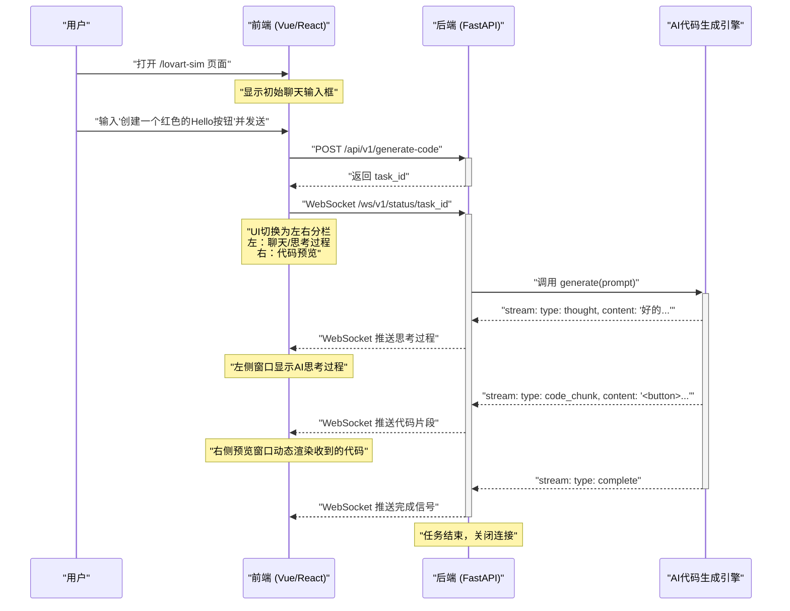
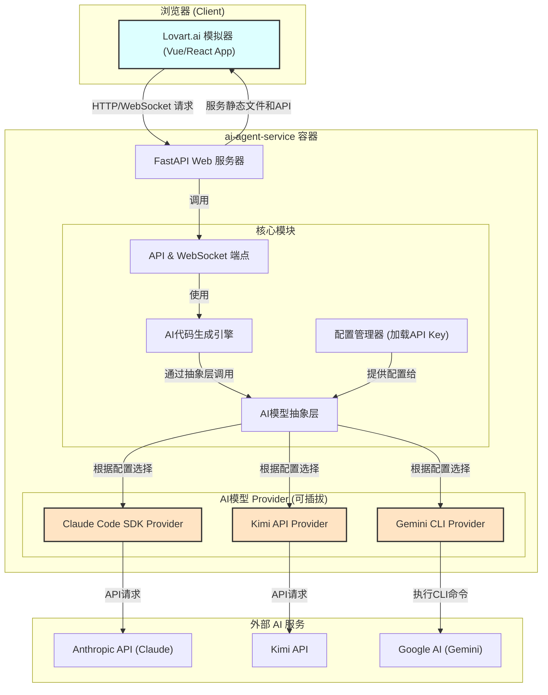

# 设计文档: 核心AI编码服务 (模拟 Lovart.ai)

> **文档状态**: 初稿
> **负责人**: AI 架构师
> **更新日期**: 2024-08-04

### 1. 概述与目标

为解决“AI明信片”项目中风险最高、技术最复杂的**AI实时前端编码**环节，我们提议先独立开发一个模拟 `lovart.ai` 的原型。该原型将在 `ai-agent-service` 的开发环境中构建，旨在达成以下目标：

- **技术验证**: 验证使用 Claude Code SDK、Kimi、Gemini CLI 等大语言模型生成高质量、可渲染前端代码的可行性。
- **模块化构建**: 将AI编码能力封装成一个高内聚、低耦合的独立服务。
- **双重目的**:
    1.  提供一个可通过Web访问的交互式页面(`lovart.ai`模拟器)，用于直观调试和展示AI编码能力。
    2.  提供一个独立的、标准化的API接口，未来可无缝对接到“AI明信片”项目的 `AI Agent Service` 工作流中。
- **可配置性**: AI模型的API Key和URL等需易于配置和切换，以适应不同模型（如Claude、Kimi）和成本考量。

### 2. 核心功能与用户流程 (Lovart.ai 模拟器)

模拟器的核心流程旨在提供一个从用户输入到实时预览的闭环体验。



### 3. 系统架构设计

该服务将作为 `ai-agent-service` 的一部分，但内部逻辑高度模块化，包含前端、后端API、AI能力抽象层等。



**架构说明**:
- **模块化**: `ai-agent-service` 内部的 "核心模块" 与 "AI模型 Provider" 完全解耦。
- **可插拔Provider**: 每个 "Provider" 都是一个独立的Python类，负责与一个具体的AI服务（如Anthropic API, Google AI API）通信。切换AI服务商，本质上就是切换加载的Provider类，无需改动核心业务逻辑。

### 4. 模块化拆解与设计

#### 4.1. 前端 (Vue / React)
- **技术栈**: Vue3 + Vite (或 React + Vite)，Pinia/Zustand状态管理，axios, a-shell (模拟终端)。
- **目的**: 作为一个独立的单页应用(SPA)，将被FastAPI作为静态文件提供服务。
- **核心组件**:
    - `ChatView.vue`: 初始的聊天输入界面。
    - `WorkspaceView.vue`: 左右分栏的工作区视图。
        - `ThinkingStream.vue` (左栏): 负责接收并渲染WebSocket推送的AI思考过程流。
        - `PreviewFrame.vue` (右栏): 内嵌一个`<iframe>`，使用`srcdoc`属性来安全地、动态地渲染后端传来的HTML/CSS/JS代码。
    - **API Client**: 封装与后端的HTTP和WebSocket通信逻辑。

#### 4.2. 后端 (FastAPI)

##### 4.2.1. AI 模型抽象层 (Provider 模式 - 核心扩展设计)

这是确保系统可扩展性的基石。我们严格区分 **Provider** (提供AI能力的服务商，如Claude、Gemini) 和 **Model** (具体的模型，如 `claude-3-5-sonnet` 或 `k2`)。

- **目标**: 隔离不同AI服务商的SDK、API或CLI的实现差异，提供统一、稳定的内部调用接口。

- **抽象基类 `BaseCodeProvider`**:
    ```python
    from abc import ABC, abstractmethod
    from typing import AsyncGenerator

    class BaseCodeProvider(ABC):
        @abstractmethod
        async def generate(
            self, 
            prompt: str,
            session_id: str,
            model: str | None = None
        ) -> AsyncGenerator[dict, None]:
            """
            根据给定的prompt异步生成代码。
            
            Args:
                prompt (str): 用户的输入描述。
                session_id (str): 用于跟踪和调试的会话ID。
                model (str | None): 指定要使用的具体模型。
                                      如果为None，则使用Provider的默认模型。
            
            Yields:
                dict: 代表生成事件的字典。
            """
            yield {}
    ```

- **第一阶段实现类: `ClaudeCodeProvider`**:
    - **职责**: 封装 `claude-code-sdk` 的所有交互逻辑。
    - **实现**:
        - `__init__`: 从配置中加载`CLAUDE_API_KEY`, `CLAUDE_API_URL`。
        - `generate`:
            - 如果`model`参数未提供，则使用配置中的`CLAUDE_DEFAULT_MODEL`。
            - 允许通过`model`参数传入 `CLAUDE_FALLBACK_MODEL` (如K2模型) 或其他兼容模型，实现模型切换。
            - 调用 `claude-code-sdk` 并将返回的事件流转换为标准化的字典格式进行 `yield`。

- **未来扩展类 (设计预留)**:
    - `GeminiCLIProvider(BaseCodeProvider)`: 未来实现时，将在此类中封装 `asyncio.create_subprocess_exec` 逻辑来调用 Gemini CLI。
    - `QwenCoderProvider(BaseCodeProvider)`: 未来实现时，将在此类中封装与Qwen Coder SDK或API的交互。

- **Provider 工厂**: `get_provider()` 函数将根据配置 `AI_PROVIDER_TYPE` 返回相应的Provider单例。

##### 4.2.2. 配置管理器

- **目标**: 提供一个清晰、可扩展的配置方案，支持多Provider。
- **实现**: 使用Pydantic的`BaseSettings`，从环境变量加载配置。

    ```python
    from pydantic_settings import BaseSettings

    class Settings(BaseSettings):
        # ... 其他设置 ...

        # --- Provider路由配置 ---
        AI_PROVIDER_TYPE: str = "claude"  # 'claude', 'gemini', 'qwen'

        # --- Claude Provider Settings ---
        CLAUDE_API_KEY: str | None = None
        CLAUDE_API_URL: str | None = None
        CLAUDE_DEFAULT_MODEL: str = "claude-3-5-sonnet-20240620"
        CLAUDE_FALLBACK_MODEL: str | None = None # 用于K2等备用模型

        # --- Gemini Provider Settings (Future) ---
        GEMINI_API_KEY: str | None = None
        
        # --- Qwen Provider Settings (Future) ---
        QWEN_API_KEY: str | None = None

        class Config:
            case_sensitive = True
            env_file = ".env"
            env_file_encoding = 'utf-8'
    
    settings = Settings()
    ```

### 5. 与"AI明信片"项目的集成方案

当此AI编码服务开发完成后，它将作为 `AI Agent Service` 的一个内置“工具”被使用：

1.  在 `AI Agent Service` 的 `ToolBox` 中，创建一个新的工具，例如`FrontendCodingTool`。
2.  这个工具的实现逻辑非常简单：直接调用我们已经开发好的`AI代码生成引擎`的Python函数。
3.  在“AI明信片”的主工作流中，当文案和图片都生成完毕后，最后一步就是调用`FrontendCodingTool`，将文案、图片URL和风格描述整合成一个强大的Prompt，生成最终的动态明信片代码。

### 6. 开发环境与部署 (`docker-compose.yml` 调整)

为了支持这个模拟器，我们需要对 `ai-agent-service` 在 `docker-compose.yml` 中的定义进行微调，以匹配新的配置结构。

```yaml
# In docker-compose.yml

services:
  # ... other services

  # 更新 ai-agent-service
  x-ai-agent-base: &ai-agent-base
    # ... (build, volumes, etc. remain the same)
    environment:
      - DATABASE_URL=${DATABASE_URL}
      # --- AI 编码服务配置 ---
      - AI_PROVIDER_TYPE=claude
      # Claude Provider
      - CLAUDE_API_KEY=${CLAUDE_API_KEY}
      - CLAUDE_DEFAULT_MODEL=claude-3-5-sonnet-20240620
      - CLAUDE_FALLBACK_MODEL=${K2_MODEL_NAME} # 示例
      # Gemini Provider (Future)
      # - GEMINI_API_KEY=${GEMINI_API_KEY}
    # ...

  ai-agent-service:
    <<: *ai-agent-base
    profiles: ["agent"]
    ports:
      - "8001:8000" # 原有的API端口
      # 新增一个端口，用于访问Lovart.ai模拟器Web界面
      - "8002:8002" 
    command: uvicorn app.main:app --host 0.0.0.0 --port 8000 --reload

  # ... (其他 ai-agent-service 变体)
```
