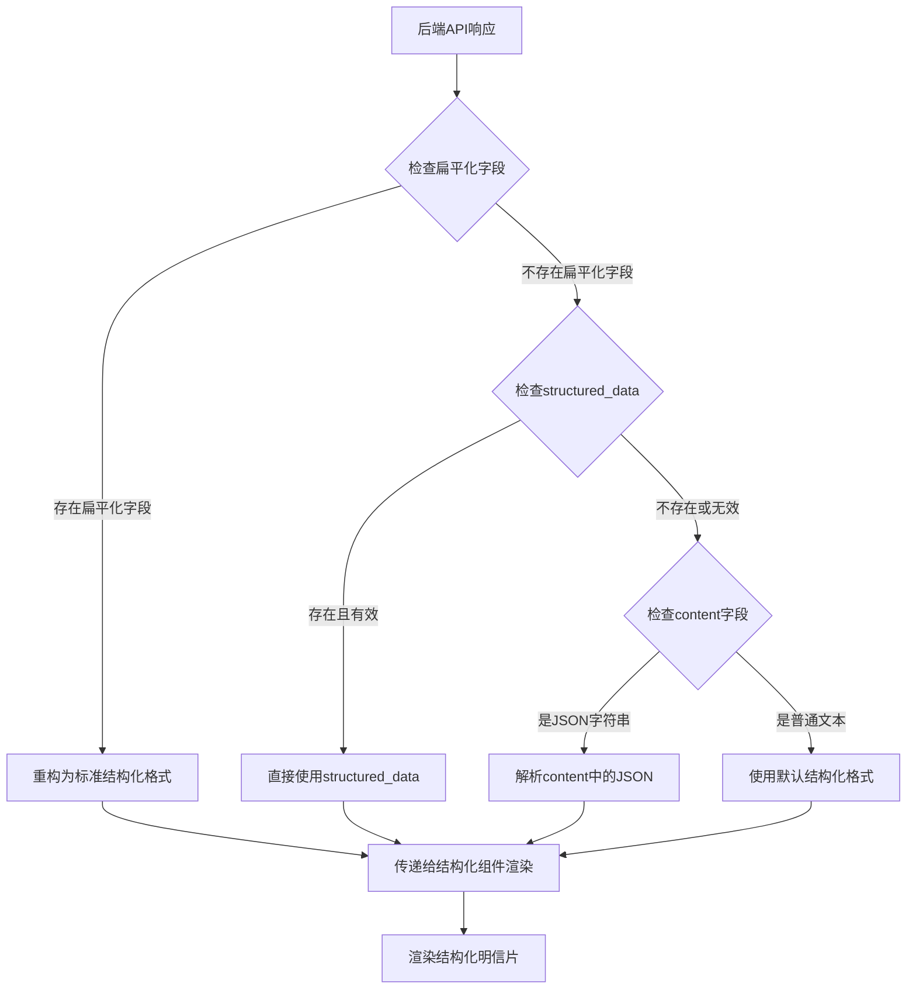

# 小程序与后端接口协议设计规范

## 文档概述

本文档定义了微信小程序前端与后端服务之间的接口协议规范，包括数据结构、解析逻辑、渲染优先级等关键规范，确保前后端数据交互的一致性和可靠性。

**创建时间**: 2025-08-29  
**版本**: 2.0 (扁平化数据结构版本)  
**维护者**: AI开发团队  

## ⚠️ 重要更新说明

**版本 2.0** 引入了后端扁平化数据结构，解决了微信小程序复杂对象传递时的字段丢失问题。新版本采用**后端扁平化 + 前端重构**的架构模式。

## 1. 核心数据结构定义

### 1.1 后端返回的完整数据结构

基于实际测试的后端API返回结构：

```json
{
  "code": 0,
  "message": "获取结果成功",
  "data": {
    // 基础元数据
    "postcard_id": "string",
    "task_id": "string", 
    "status": "completed",
    "created_at": "2025-08-29T04:54:45.315565+00:00",
    "generation_time": 0,
    
    // 🔥 关键数据字段 - 按优先级排序
    "structured_data": {
      // 这是最重要的数据源，优先使用
      "mood": {
        "primary": "舒畅",
        "intensity": 8,
        "secondary": "浪漫", 
        "color_theme": "#FF8C00"
      },
      "title": "西湖落日熔金，随风寄去的温柔",
      "visual": {
        "style_hints": {
          "color_scheme": ["#FFD700", "#FF6347", "#ADD8E6"],
          "layout_style": "artistic",
          "animation_type": "gradient"
        },
        "background_image_url": "http://localhost:8080/static/generated/gemini_generated_13eb4e7e.png"
      },
      "content": {
        "quote": {
          "text": "May the beauty of this sunset bring you peace and joy.",
          "author": "Anonymous", 
          "translation": "愿这落日的美丽，为你带来平和与喜悦。"
        },
        "main_text": "今日在杭州西湖边，撞见了落日熔金的绝美瞬间...",
        "hot_topics": {
          "douyin": "（搭配一段唯美夕阳延时摄影）...",
          "xiaohongshu": "谁懂啊，西湖的日落真的美到让人失语！..."
        }
      },
      "context": {
        "weather": "傍晚，微风习习，晚霞绚烂",
        "location": "杭州西湖",
        "time_context": "evening"
      },
      "recommendations": {
        "book": [
          {
            "title": "《西湖梦寻》",
            "author": "张岱", 
            "reason": "这本书如同一本穿越时空的明信片..."
          }
        ],
        "movie": [
          {
            "title": "《情书》",
            "reason": "这部电影以其纯净的画面和细腻的情感...",
            "director": "岩井俊二"
          }
        ]
      }
    },
    
    // ⚠️ 遗留字段 - 包含JSON字符串，不应直接渲染
    "content": "```json\n{\"主标题\": \"西湖落日，心随景动\"...}\n```",
    "concept": "```json\n{\"主题概念\": \"...\"}```",
    
    // 图片和组件相关
    "image_url": "http://localhost:8080/static/generated/gemini_generated_13eb4e7e.png",
    "card_image_url": null,
    "card_html": null, 
    "miniprogram_component": null,
    "component_type": "postcard",
    "has_animation": false,
    "has_interactive": false,
    "frontend_code": null,
    "preview_url": null
  }
}
```

### 1.2 后端扁平化数据结构（版本2.0新增）

为了解决微信小程序复杂对象传递时的字段丢失问题，后端API现在返回扁平化的字段：

```json
{
  // 基础字段
  "card_title": "西湖落日熔金，随风寄去的温柔",
  
  // 情绪字段
  "mood_primary": "舒畅",
  "mood_intensity": 8,
  "mood_secondary": "浪漫",
  "mood_color_theme": "#FF8C00",
  
  // 视觉样式字段
  "visual_color_scheme": ["#FFD700", "#FF6347"],
  "visual_layout_style": "artistic", 
  "visual_animation_type": "gradient",
  "visual_background_image": "http://localhost:8080/static/generated/gemini_generated_13eb4e7e.png",
  
  // 内容字段
  "content_main_text": "今日在杭州西湖边，撞见了落日熔金的绝美瞬间...",
  "content_quote_text": "May the beauty of this sunset bring you peace and joy.",
  "content_quote_author": "Anonymous",
  "content_quote_translation": "愿这落日的美丽，为你带来平和与喜悦。",
  "content_hot_topics_douyin": "（搭配一段唯美夕阳延时摄影）...",
  "content_hot_topics_xiaohongshu": "谁懂啊，西湖的日落真的美到让人失语！...",
  
  // 上下文字段
  "context_weather": "傍晚，微风习习，晚霞绚烂",
  "context_location": "杭州西湖",
  "context_time": "evening",
  
  // 推荐内容字段
  "recommendations_music_title": "白墙",
  "recommendations_music_artist": "程璧",
  "recommendations_music_reason": "程璧的歌声如溪水般清澈...",
  "recommendations_book_title": "《西湖梦寻》",
  "recommendations_book_author": "张岱",
  "recommendations_book_reason": "这本书如同一本穿越时空的明信片...",
  "recommendations_movie_title": "《情书》",
  "recommendations_movie_director": "岩井俊二",
  "recommendations_movie_reason": "这部电影以其纯净的画面和细腻的情感...",
  
  // 🔄 兼容性：仍保留原structured_data字段供调试使用
  "structured_data": { /* 原始嵌套结构 */ }
}
```

### 1.3 数据字段优先级定义

按重要性和使用优先级排序：

| 优先级 | 字段类型 | 用途 | 数据类型 | 必需性 |
|--------|----------|------|----------|--------|
| **P0 (最高)** | **扁平化字段** | 小程序端主要数据源，避免传递丢失 | String/Number | 必需 |
| **P1** | `structured_data` | 调试和兼容性保留 | Object | 可选 |
| **P2** | `image_url` | 背景图片，Gemini生成的原图 | String | 必需 |
| **P3** | `card_image_url` | HTML转换后的卡片图片 | String | 可选 |
| **P4** | `content` | 原始内容（遗留，已弃用） | String | 遗留字段 |

## 2. 前端数据解析规范（版本2.0更新）

### 2.1 扁平化数据解析流程



### 2.2 扁平化数据解析函数（版本2.0）

优先使用后端扁平化字段的新解析逻辑：

```javascript
/**
 * 扁平化数据解析函数 - 版本2.0
 * @param {Object} cardData - 后端返回的原始卡片数据
 * @returns {Object} - 标准化的卡片数据，包含structured_data
 */
function parseCardData(cardData) {
  let structuredData = null;
  let hasStructuredData = false;
  let debugInfo = {
    dataSource: '',
    parseSuccess: false,
    originalContent: ''
  };

  // 🆕 优先使用后端扁平化字段
  if (cardData.mood_primary || cardData.card_title || cardData.content_main_text) {
    debugInfo.dataSource = 'backend_flattened';
    debugInfo.parseSuccess = true;
    
    // 重构回标准结构化数据格式
    structuredData = {
      title: cardData.card_title || '',
      mood: {
        primary: cardData.mood_primary || '',
        intensity: cardData.mood_intensity || 0,
        secondary: cardData.mood_secondary || '',
        color_theme: cardData.mood_color_theme || ''
      },
      visual: {
        style_hints: {
          color_scheme: cardData.visual_color_scheme && Array.isArray(cardData.visual_color_scheme) 
            ? cardData.visual_color_scheme 
            : ['#6366f1', '#8b5cf6'],
          layout_style: cardData.visual_layout_style || 'minimal',
          animation_type: cardData.visual_animation_type || 'float'
        },
        background_image_url: cardData.visual_background_image || cardData.image_url
      },
      content: {
        main_text: cardData.content_main_text || '',
        quote: {
          text: cardData.content_quote_text || '',
          author: cardData.content_quote_author || '',
          translation: cardData.content_quote_translation || ''
        },
        hot_topics: {
          douyin: cardData.content_hot_topics_douyin || '',
          xiaohongshu: cardData.content_hot_topics_xiaohongshu || ''
        }
      },
      context: {
        weather: cardData.context_weather || '',
        location: cardData.context_location || '',
        time_context: cardData.context_time || ''
      },
      recommendations: {
        music: cardData.recommendations_music_title ? [{
          title: cardData.recommendations_music_title,
          artist: cardData.recommendations_music_artist,
          reason: cardData.recommendations_music_reason
        }] : [],
        book: cardData.recommendations_book_title ? [{
          title: cardData.recommendations_book_title,
          author: cardData.recommendations_book_author,
          reason: cardData.recommendations_book_reason
        }] : [],
        movie: cardData.recommendations_movie_title ? [{
          title: cardData.recommendations_movie_title,
          director: cardData.recommendations_movie_director,
          reason: cardData.recommendations_movie_reason
        }] : []
      }
    };
    
    hasStructuredData = true;
  }
  
  // 降级1：使用原structured_data字段
  else if (cardData.structured_data) {
    debugInfo.dataSource = 'structured_data';
    let rawStructuredData = cardData.structured_data;
    
    if (typeof rawStructuredData === 'string') {
      try {
        rawStructuredData = extractJsonFromText(rawStructuredData) || JSON.parse(rawStructuredData);
      } catch (e) {
        console.warn('解析structured_data失败:', e);
        rawStructuredData = null;
      }
    }
    
    if (rawStructuredData) {
      structuredData = rawStructuredData;
      hasStructuredData = true;
      debugInfo.parseSuccess = true;
    }
  }
  
  // 降级2：解析content字段中的JSON
  else if (cardData.content && typeof cardData.content === 'string') {
    debugInfo.dataSource = 'content_json';
    const parsed = extractJsonFromText(cardData.content);
    if (parsed) {
      structuredData = buildStructuredFromParsed(parsed);
      hasStructuredData = true;
      debugInfo.parseSuccess = true;
    }
  }
  
  // 最终降级：返回默认格式
  if (!hasStructuredData) {
    debugInfo.dataSource = 'fallback';
    structuredData = {
      title: cardData.concept || 'AI明信片',
      content: {
        main_text: cardData.content || '每一天都值得被温柔记录'
      },
      visual: {
        style_hints: {
          color_scheme: ['#3b82f6', '#1e40af'],
          layout_style: 'minimal',
          animation_type: 'pulse'
        },
        background_image_url: cardData.image_url
      }
    };
    hasStructuredData = true; // 使用默认结构也算作有效数据
  }
  
  return { 
    structuredData, 
    hasStructuredData, 
    debugInfo 
  };
}
```

### 2.3 JSON提取工具函数

```javascript
/**
 * 智能提取文本中的JSON数据
 * @param {string} text - 包含JSON的文本
 * @returns {Object|null} - 解析后的JSON对象或null
 */
function extractJsonFromText(text) {
  if (!text || typeof text !== 'string') return null;
  
  // 移除markdown代码块包装
  const cleanText = text.replace(/```json\s*([\s\S]*?)\s*```/g, '$1').trim();
  
  // 尝试直接解析
  try {
    return JSON.parse(cleanText);
  } catch (e) {
    // 尝试提取第一个JSON对象
    const jsonMatch = cleanText.match(/\{[\s\S]*\}/);
    if (jsonMatch) {
      try {
        return JSON.parse(jsonMatch[0]);
      } catch (e2) {
        return null;
      }
    }
    return null;
  }
}
```

## 3. 前端渲染优先级规范

### 3.1 组件渲染优先级

在WXML中必须按以下优先级进行条件渲染：

```xml
<!-- 1. 最高优先级：结构化卡片组件 -->
<structured-postcard 
  wx:if="{{cardData.structured_data}}"
  structured-data="{{cardData.structured_data}}"
  background-image="{{cardData.structured_data.visual.background_image_url || cardData.image_url}}"
  fallback-english="{{cardData.english}}"
  show-animation="{{true}}"
  size-mode="standard"
  bind:cardtap="onStructuredCardTap"
  bind:recommendationtap="onRecommendationTap"
  bind:share="onStructuredCardShare"
></structured-postcard>

<!-- 2. 次优先级：动态卡片组件 -->
<dynamic-postcard 
  wx:elif="{{cardData.miniprogram_component}}"
  component-data="{{cardData.miniprogram_component}}"
  bind:tap="onDynamicCardTap"
></dynamic-postcard>

<!-- 3. 降级方案：美化卡片布局 -->
<view class="beautiful-postcard" wx:elif="{{cardData.image_url}}">
  <!-- 基于背景图片的美化显示 -->
</view>

<!-- 4. 最终降级：错误提示 -->
<view class="error-fallback" wx:else>
  <text>卡片数据加载失败</text>
</view>
```

### 3.2 背景图片优先级

图片URL的选择优先级：

1. `structured_data.visual.background_image_url` (最优先)
2. `card_image_url` (HTML转换后图片)
3. `image_url` (Gemini生成原图)
4. 默认占位图片

```javascript
// 背景图片选择逻辑
function getBackgroundImage(cardData) {
  return cardData.structured_data?.visual?.background_image_url ||
         cardData.card_image_url ||
         cardData.image_url ||
         '/images/default-postcard-bg.jpg';
}
```

## 4. API调用规范

### 4.1 API端点定义

| 功能 | 方法 | 端点 | 描述 |
|------|------|------|------|
| 创建任务 | POST | `/api/v1/miniprogram/postcards/create` | 创建明信片生成任务 |
| 查询状态 | GET | `/api/v1/miniprogram/postcards/status/{task_id}` | 轮询任务状态 |
| 获取结果 | GET | `/api/v1/miniprogram/postcards/result/{task_id}` | 获取最终生成结果 |
| 用户列表 | GET | `/api/v1/miniprogram/postcards/user` | 获取用户历史作品 |

### 4.2 错误处理规范

```javascript
// 统一错误处理
try {
  const result = await postcardAPI.getResult(taskId);
  const parsedData = parseCardData(result);
  // 使用解析后的数据
} catch (error) {
  console.error('API调用失败:', error);
  // 显示友好的错误信息
  this.setData({
    error: '获取明信片失败，请重试',
    loading: false
  });
}
```

## 5. 开发规范要求

### 5.1 强制性规范

1. **数据解析统一性**: 所有页面必须使用相同的 `parseCardData()` 函数
2. **渲染优先级**: 必须按照定义的优先级进行条件渲染  
3. **错误处理**: API调用必须包含完整的错误处理逻辑
4. **类型检查**: 访问深层属性前必须进行存在性检查

### 5.2 禁止的做法

1. ❌ **禁止直接显示 `content` 字段**: 会显示原始JSON字符串
2. ❌ **禁止跳过数据解析**: 必须调用解析函数处理数据
3. ❌ **禁止硬编码数据结构**: 必须通过解析函数适配不同格式
4. ❌ **禁止在WXML中使用复杂表达式**: 逻辑判断应在JS中预处理

### 5.3 代码审查检查点

每次修改涉及数据处理的代码时，必须检查：

- [ ] 是否调用了标准的数据解析函数
- [ ] 是否按优先级使用了正确的数据字段
- [ ] 是否包含了完整的错误处理
- [ ] 是否遵循了渲染组件的优先级规范
- [ ] 是否避免了在模板中使用复杂表达式

## 6. 版本更新记录

| 版本 | 日期 | 更新内容 | 影响范围 |
|------|------|----------|----------|
| 1.0 | 2025-08-29 | 初始版本，定义基础协议规范 | 全部前端页面 |
| 2.0 | 2025-08-29 | 引入后端扁平化数据结构，解决小程序传递丢失问题 | 后端API + 前端解析逻辑 |

### 版本2.0重大更新说明

**问题背景**：微信小程序在通过 `setData` 传递复杂嵌套对象给组件时存在已知限制，导致 `mood`、`recommendations` 等特定字段在传递过程中丢失。

**解决方案**：采用**后端扁平化 + 前端重构**的架构模式：
1. 后端API返回扁平化字段（如 `mood_primary`、`recommendations_music_title` 等）
2. 前端优先检测扁平化字段，重构回标准 `structured_data` 格式
3. 保持原有 `structured_data` 字段作为兼容性备用

**技术优势**：
- 彻底解决小程序数据传递问题
- 向后兼容原有数据结构
- 提供清晰的数据来源追踪（`debugInfo.dataSource`）
- 支持渐进式升级

## 7. 相关文档链接

- [后端API规范文档](./07-api-specification.md)
- [前端小程序架构文档](./01-frontend-miniprogram.md)
- [数据库架构文档](./06-database-schema.md)

---

**⚠️ 重要提醒**: 本文档是前后端协作的关键规范，任何修改都可能影响整个系统的数据流，修改前必须通知所有相关开发人员并更新版本号。