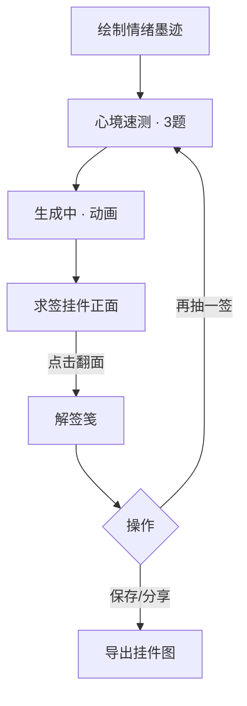

# 心象求签挂件体验设计文档（v2）

> 版本：2025-09-XX  
> 作者：AI 明信片项目组  
> 用途：指导产品、设计、微信小程序开发、AI 工作流团队完成“求签挂件”体验落地。

---

## 1. 背景与目标

- 当前卡片体验已更换为“求签挂件”形式，挂件素材已全部准备完毕，目录见 `resources/签体/`（18 款 1024×1024 PNG）。
- 问答题库已提供在 `resources/题库/question.json`，需作为“心境速测”的数据源。
- 本次文档明确：
  1. 基于整图签体资源的展示规范（正面/背面布局、文本区域、氛围背景处理）。
  2. 后端与 AI 输出结构（签体配置、解签数据、问答洞察等）。
  3. 微信小程序前端实现指引（UI 方案、动画、交互流程、组件拆分）。
  4. 心境问答交互与数据上报方式。

目标体验：用户绘画 → 回答 3 题 → 等待生成 → 在结果页看到随机挂件正面（签名 + 氛围光圈） → 点击翻面查看解签笺（洞察 + 行动建议） → 可保存/分享。

---

## 2. 资源概览

### 2.1 签体素材
- 目录：`resources/签体/`
- 文件示例：
  - `金边墨玉璧 (沉稳庄重).png`
  - `如意结 (万事如意).png`
  - `青花瓷扇 (文化底蕴).png`
- 每张尺寸：1024×1024，带透明背景；已对中心区域做白色填充、顶端绳扣保持透空。
- 使用方式：不再做框架拼装，直接把整张 PNG 作为挂件主体渲染。需根据签体形状自适应签名文字位置。

### 2.2 签体配置文件（新增）
项目已在 `resources/签体/charm-config.json` 中预置 18 条签体配置，可直接拷贝到小程序资源目录（建议同步到 `src/miniprogram/assets/charm-config.json`）。每条配置描述该签体的标题排版、光圈、配色等属性。结构示例如下：
```json
[
  {
    "id": "lotus-circle",
    "name": "莲花圆牌 (平和雅致)",
    "image": "莲花圆牌 (平和雅致).png",
    "title": {
      "type": "vertical",        // vertical 或 horizontal
      "position": { "x": 512, "y": 520 },
      "maxChars": 4,
      "lineHeight": 66,
      "fontSize": 64,
      "fontWeight": 600
    },
    "subtitle": {
      "visible": true,
      "position": { "x": 512, "y": 640 },
      "maxChars": 10,
      "fontSize": 32,
      "color": "#3B3D4B"
    },
    "glow": {
      "shape": "circle",          // circle / ellipse / diamond
      "radius": [360, 360],
      "opacity": 0.45,
      "blendMode": "screen"
    },
    "suggestedPalette": ["#90CAF9", "#F8BBD0"],
    "note": "适合表现温和、安宁主题，正面文字控制在两列以内"
  }
]
```
- `title.type`：竖排文本（推荐 2～4 字，或“XX签”），横排用于长条类签体。
- `glow`：背景氛围光圈参数，AI 生成图会先缩放模糊，再按照此配置叠加。
- `suggestedPalette`：背面解签笺、页面背景等可引用的色板，以保持整体调和。
- `note`：签体使用注意事项，便于前端/设计把握排版尺度。
- 若后续新增签体，请在同一 JSON 内追加配置，确保 `id` 唯一。

### 2.3 问答题库
- 路径：`resources/题库/question.json`
- JSON 结构字段：`id`、`category`、`question`、`options`（`id`+`label`）。
- 小程序启动时一次性加载到内存，可缓存到 `storage`，按分类随机选题。

---

## 3. 用户体验流程



- **问答弹层**：绘画完成后弹出底部全宽面板，逐题滑动；答完 3 题进入生成流程。每日允许跳过 1 次。
- **结果页布局**：
  - 背景：柔和渐变 + AI 氛围光圈。
  - 中心：签体 PNG + 签名。
  - 底部：按钮区（翻面、再抽、保存）。
- **解签笺**：翻面后，整个页面淡入“解签纸”，挂件退到背景作为装饰。
- **动画**：翻面采用 `rotateY`（模拟翻页），解签笺出现时带轻微弹入。

---

## 4. 正面视觉规范

1. **挂件主体**
   - 使用 `image` 组件渲染 PNG，设置 `mode="aspectFit"`，最大宽度≈屏宽 80%。
   - 将 AI 背景图作为低透明度光圈放在挂件背后（使用 `view` 自定义背景或 `canvas` 预合成）。

2. **签名标题**
   - 从 AI 返回的 `charm.title`（推荐 2～4 字，如“静心签”）。
   - 按配置中的 `title.type` 决定排版：
     - `vertical`：使用 `writing-mode: vertical-rl`，居中对齐；
     - `horizontal`：水平排，字体大小随签体长宽比调节。
   - 字体建议：
     - 主标题：自带黑体 + 自定义字体（如阿里巴巴普惠体/思源宋体）组合。
     - 使用 `text-shadow` 做 1～2px 的微阴影，增强层次。

3. **副标题 / 祝语**
   - 控制在 10 字以内，位置由 `subtitle.position` 决定。若某签体不适合展示副标（如扇形），`subtitle.visible=false`。
   - 文案风格：简短祝福，如“愿你心澄如镜”。

4. **背景氛围光圈**
   - 将 AI 生成图 (`art_direction.image_url`) 等比缩小到挂件 1.2× 大小，应用高斯模糊（建议 40px），透明度 0.3～0.5。
   - 形状按配置 `glow.shape` 裁剪，可使用 `clip-path` 或直接在 `canvas` 合成。

---

## 5. 翻面与解签笺设计

### 5.1 视觉结构
- 翻面后，挂件缩放 50%，置于背景上方（作为装饰）。
- 前景层显示“解签笺”：
  - 形式：无边框卷轴或卡片，宽度约屏宽 88%，圆角 24px。
  - 背景：浅米色或浅灰加细腻纹理（可引用 `paperTexture`，若无则用 CSS 背景图）。
  - 顶部增加一条色带或印章式标题增强仪式感。

### 5.2 解签内容结构
| 区块 | 字段来源 | 展示要求 |
| --- | --- | --- |
| 标题 | `interpretation.headline` | 字号 36，主色调取自 `suggestedPalette`。|
| 绘画洞察 | `drawing_observation.summary` + `details` | 使用“描点”风格：先一句总结，再列出 1～2 条 bullet。|
| 问答洞察 | `quiz_insights.summary` | 放在“心境速测回声”标题下，用引用样式。|
| 行动建议 | `interpretation.body` | 每条前缀小图标（如 ✦），保持 2～3 条，句子 12～18 字。|
| 免责声明 | 固定文案：“灵感源自传统文化启迪，不作吉凶断言。” |

- 如需放置配图，可在笺底部加一张 120×120 的水墨印章或花纹（可从签体读取 `accent` 色）。默认纯前端绘制即可，无需额外图片。

### 5.3 微信小程序实现建议
- 使用两个层级：`view`（正面挂件层）和 `view`（背面笺层），配合 `animation` 切换。
- 解签笺使用 `scroll-view`，保证内容超出时可滚动。
- 自定义卡片背景：
  - 通过 `background-image: linear-gradient(...)` 加 `background-blend-mode: multiply` 形成纸张质感。
  - 文本颜色选用 #2F2A26（深棕）或 #1F2937（墨青），形成高级感。

### 5.4 动效建议
- 翻面动画：
  ```js
  const animation = wx.createAnimation({ duration: 500, timingFunction: 'ease-in-out' })
  animation.rotateY(180).step()
  ```
- 解签笺出现：`translateY(30px) → 0`、`opacity 0 → 1`。
- 背景挂件轻微摇摆，可使用 `animation: sway 4s infinite alternate ease-in-out`。

---

## 6. 心境速测（问答）设计

### 6.1 页面/组件
- 新增组件 `components/quiz-sheet/`，包含：
  - 顶部简介：“用 3 个问题，让心象更懂你”。
  - 题干区域 + 选项区（支持图标/文字）。
  - 底部进度条（1/3、2/3、3/3）。
  - “稍后再答”按钮（每日限一次，通过 storage 记录 `skip_date`）。

### 6.2 交互流程
1. 绘画提交后立即弹出 `quiz-sheet`。
2. 每题答完点击“下一题”，最后一题改成“送出心声”。
3. 若用户关闭/跳过，则默认 `quiz_answers=[]`，但须提示“回答将让解签更贴近你”。
4. 提交后显示 loading 状态（按钮改成灰色 + loading icon）。

### 6.3 题目选择策略
- 题库共计若干分类（mood、pressure、action、future……）。
- 每次生成随机抽 3 类，保证多维度覆盖（可使用类别列表打乱后取前 3）。
- 题目结构：`{ id, category, question, options[] }`；选项 `label` 最好在 12 字以内。
- 答案上报结构：
```json
{
  "quiz_answers": [
    { "question_id": "mood_weather_01", "option_id": "breeze" },
    { "question_id": "pressure_room_06", "option_id": "clean_up" },
    { "question_id": "future_wish_03", "option_id": "companion" }
  ]
}
```
- 后端对题号做校验，不存在则忽略并记录日志。

### 6.4 UI 风格参考
- 题干字体 34px，选项卡片 32px，圆角 24px，选中状态使用品牌色+浅色背景。
- 可借鉴“微信读书 · 读后感测验”或“小睡眠 · 睡姿测试”等小程序的轻问答样式：卡片式选项、柔和渐变背景、顶部进度条。

---

## 7. AI 输出结构（新版）

```json
{
  "charm": {
    "style_id": "lotus-circle",   // 对应 charm-config.json 中的 id
    "title": "静心签",
    "subtitle": "愿你心澄如镜"
  },
  "drawing_observation": {
    "summary": "你在左下角反复停留，仿佛慢慢梳理心事。",
    "details": [
      "笔触数量 128、力度偏轻，说明你近期在探索“刚刚好”的节奏",
      "色块集中在近地面部位，代表现实琐事牵动情绪"
    ]
  },
  "quiz_insights": {
    "summary": "你希望有人分担，同时也渴望留一点独处空间。",
    "emotion_vector": { "calm": 0.55, "anxiety": 0.45 },
    "action_focus": ["整理居住空间", "表达内心需求"]
  },
  "interpretation": {
    "headline": "收心守气，顺势而为",
    "body": [
      "今晚给家里打个电话，告诉他们你的努力。",
      "安排 30 分钟整理房间，让空间跟心绪同步。"
    ]
  },
  "art_direction": {
    "image_url": "https://...",   // AI 生成背景图
    "palette": ["#90CAF9", "#F8BBD0"],
    "texture_hint": "柔和云雾"
  },
  "disclaimer": "灵感源自传统文化启迪，不作吉凶断言。"
}
```

### 7.1 生成要点
- 模型需根据 `quiz_answers` 与 `ink_metrics` 生成对应洞察；
- `style_id` 可由模型挑选，也可由后端在响应时随机（需保证与 `charm-config` 匹配）；
- 祝语与 headline 尽量不重复，避免机械感；
- `art_direction.palette` 用于解签笺样式配色。

### 7.2 兼容字段
- 后端 `TaskStatusResponse` 需包含扁平化字段（方便小程序直接读取）：
  - `charm_title`, `charm_subtitle`, `charm_style_id`
  - `drawing_summary`, `drawing_details`
  - `quiz_summary`, `quiz_emotion_vector`, `quiz_action_focus`
  - `interpretation_headline`, `interpretation_body`
  - `background_image_url`

---

## 8. 微信小程序开发指引

### 8.1 组件拆分
1. `components/hanging-charm/index`
   - 启动时从本地 `charm-config.json` 读取配置（可通过 `require('../../assets/charm-config.json')`）。
   - 接收 `charm`, `backgroundImage`, `config`；
   - 负责正面渲染 + 翻面动画控制；
   - `.wxml` 包括：背景光圈层、签体 image、签名文字、按钮。
2. `components/charm-backside/index`
   - 接收 `interpretation`, `drawingObservation`, `quizInsights`；
   - 渲染解签笺内容。
3. `components/quiz-sheet/index`
   - 负责问答流程。

### 8.2 页面逻辑
- `pages/index/index`
  - 收集 `inkMetrics`、问答结果后调用生成接口；
  - 将返回结果存入 `currentCharm` 状态；
  - 控制 `hanging-charm` 的显示与翻面。
- `pages/postcard/postcard`
  - 展示历史签体时从存储读取 `charm_style_id`，查 `charm-config` 恢复布局。

### 8.3 样式指南
- 主题色：延用品牌蓝紫（#667EEA、#8B5CF6），搭配浅米色 (#F8F1E7) 作为解签笺背景。
- 字体：
  - 主标题：思源黑体 Bold + letter-spacing 4px。
  - 正文：思源宋体 / 苹方 Regular。确保行距 >= 1.6。
- 高级感营造：
  - 多用柔和渐变、半透明遮罩；
  - 使用细描边（#FFFFFF 30% 透明度）勾勒挂件边缘；
  - 按钮采用玻璃拟态（背景：rgba(255,255,255,0.2)，border: rgba(255,255,255,0.4) 1px）。

### 8.4 保存与分享
- 保存时使用 `canvas` 合成：背景光圈 + 签体 PNG + 签名文字（直接绘制），确保导出图片清晰；
- 分享卡片可使用正面挂件截图，附一句祝语。

---

## 9. 问答数据上报与后端要求

| 接口 | 说明 |
| --- | --- |
| `POST /api/v1/miniprogram/postcards/create` | 请求体新增 `quiz_answers`（数组）、`ink_metrics`、`historical_context`。|
| `GET /api/v1/miniprogram/postcards/status/{task_id}` | 返回上述 AI 输出结构。|
| `GET /api/v1/miniprogram/postcards/me` | 历史数据需携带 `charm_style_id` 以便恢复挂件。|

后端需：
- 校验题库 ID（未知则忽略并记日志）；
- 记录问答答案用于日志/分析；
- 兼容未回答问卷的情况（`quiz_insights` 可提供 fallback 文案）。

---

## 10. 测试清单

| 项目 | 验证点 |
| --- | --- |
| 正面展示 | 不同签体随机渲染，签名位置正确；背景光圈不遮挡签体。 |
| 翻面动画 | 翻面顺滑，解签笺尺寸适配不同屏幕。 |
| 文案限制 | 标题/副标/祝语超长时自动换行或缩放。 |
| 问答流程 | 随机抽题无重复；跳过次数限制；答案上报准确。 |
| AI 数据 | `drawing_observation`、`quiz_insights` 与输入相关；再生结果有差异。 |
| 保存/分享 | 导出图不失真、透明区域处理正确。 |
| 性能 | 首屏渲染时间 <1.2s；问答、翻面动画在低端机流畅。 |

---

## 11. 后续规划

- 根据签体主题推出节气/节日限定挂件与解签笺皮肤。
- 结合问答统计制作“心象旅程”记录页。
- 研究加入语音祝语或背景音乐，增强沉浸感。

---

**备注**：如需参考优秀 UI，可观察以下小程序：
- 「一禅小和尚签」：签体风格与质感处理；
- 「国家图书馆·国潮签文」：卷轴式解签展示；
- 「小睡眠」问答页面：轻量问题卡片体验。

以上方案如需调整，欢迎随时反馈。EOF
