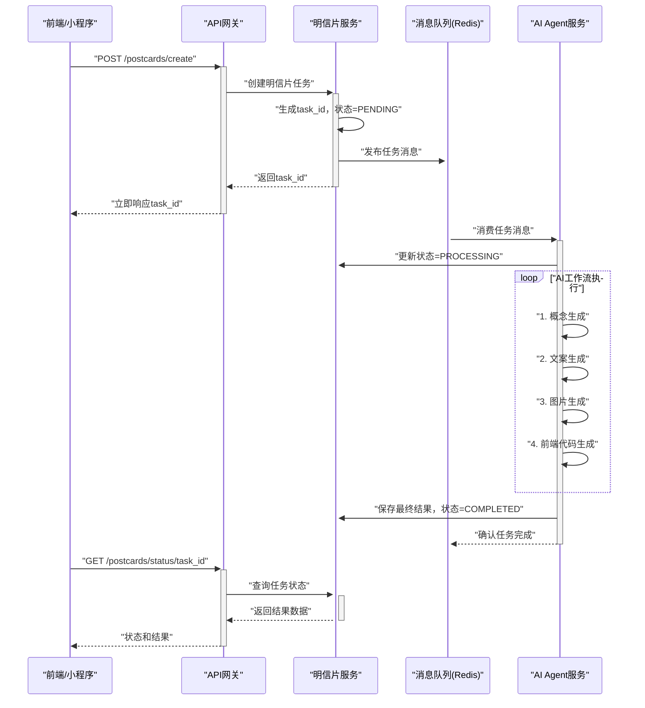

# 开发文档：异步工作流和消息队列集成实现

> **文档状态**: 开发计划  
> **优先级**: P0 - 最高优先级  
> **预估工作量**: 3-5天  
> **更新日期**: 2024-08-20  

## 1. 开发目标

将当前的同步AI代码生成改造为完整的异步明信片生成工作流，实现：

1. **消息队列集成** - 使用Redis Streams实现异步任务处理
2. **多步骤AI工作流** - 概念→文案→图片→前端代码的完整流水线  
3. **任务状态管理** - 实现可追踪的任务生命周期
4. **系统解耦** - API网关、明信片服务、AI Agent服务的异步协作

## 2. 当前实现分析

### 2.1. 现有功能
✅ **AI Agent Service** (`src/ai-agent-service/`)：
- Claude Code SDK集成完成
- 前端代码生成能力完整
- Vue.js前端界面（Lovart.ai模拟器）
- WebSocket实时通信

### 2.2. 需要改造的部分
🔄 **同步→异步转换**：
- 当前通过HTTP直接调用AI生成
- 需要改为消息队列异步处理模式

🆕 **缺失的服务**：
- 明信片服务（任务状态管理）
- 消息队列基础设施
- 多步骤工作流编排器

## 3. 技术架构设计

### 3.1. 整体异步流程



### 3.2. 服务模块设计

#### 3.2.1. 消息队列（Redis Streams）
```yaml
# docker-compose.yml 新增服务
redis:
  image: redis:7-alpine
  ports:
    - "6379:6379"
  command: redis-server --appendonly yes
  volumes:
    - redis_data:/data
```

#### 3.2.2. AI Agent Service 重构

**核心模块结构**：
```
src/ai-agent-service/
├── app/
│   ├── main.py                    # FastAPI应用入口
│   ├── worker.py                  # 新增：异步任务消费者
│   ├── orchestrator/              # 新增：工作流编排器
│   │   ├── __init__.py
│   │   ├── workflow.py            # 多步骤AI工作流
│   │   └── steps/                 # 工作流步骤
│   │       ├── concept_generator.py   # 概念生成（Gemini文本）
│   │       ├── content_generator.py   # 内容生成（Gemini文本）
│   │       ├── image_generator.py     # 图片生成（Gemini图片）
│   │       └── frontend_coder.py      # 前端编码（Claude Code SDK）
│   ├── providers/                 # 新增：AI服务提供商集成
│   │   ├── __init__.py
│   │   ├── base_provider.py           # 提供商基类
│   │   ├── gemini_text_provider.py    # Gemini文本生成
│   │   ├── gemini_image_provider.py   # Gemini图片生成
│   │   ├── claude_provider.py         # Claude代码生成（现有）
│   │   └── provider_factory.py        # 提供商工厂
│   ├── queue/                     # 新增：消息队列集成
│   │   ├── __init__.py
│   │   ├── consumer.py            # 任务消费者
│   │   ├── producer.py            # 任务生产者
│   │   └── models.py              # 任务数据模型
│   ├── utils/                     # 新增：工具模块
│   │   ├── __init__.py
│   │   ├── image_utils.py         # 图片处理工具
│   │   ├── text_utils.py          # 文本处理工具
│   │   └── validation.py          # 数据验证工具
│   └── coding_service/            # 现有：保留，作为工作流的最后一步
```

**3.2.2.1. Gemini Provider 实现**

**Gemini 文本生成Provider**：
```python
# src/ai-agent-service/app/providers/gemini_text_provider.py
import google.generativeai as genai
from typing import Dict, Any, Optional
from .base_provider import BaseProvider
import os

class GeminiTextProvider(BaseProvider):
    """Gemini文本生成服务提供商"""
    
    def __init__(self):
        # 配置Gemini API
        api_key = os.getenv("GEMINI_API_KEY")
        if not api_key:
            raise ValueError("GEMINI_API_KEY环境变量未配置")
            
        genai.configure(api_key=api_key)
        
        # 配置模型参数
        self.model_name = os.getenv("GEMINI_TEXT_MODEL", "gemini-1.5-flash")
        self.default_config = {
            "temperature": float(os.getenv("GEMINI_TEXT_TEMPERATURE", "0.7")),
            "max_output_tokens": int(os.getenv("GEMINI_TEXT_MAX_TOKENS", "2048")),
            "top_p": 0.8,
            "top_k": 40
        }
        
        # 初始化模型
        self.model = genai.GenerativeModel(
            model_name=self.model_name,
            generation_config=genai.GenerationConfig(**self.default_config)
        )
    
    async def generate_text(
        self, 
        prompt: str, 
        max_tokens: Optional[int] = None,
        temperature: Optional[float] = None,
        **kwargs
    ) -> str:
        """生成文本内容"""
        try:
            # 动态配置生成参数
            config = self.default_config.copy()
            if max_tokens:
                config["max_output_tokens"] = max_tokens
            if temperature is not None:
                config["temperature"] = temperature
            
            # 重新配置模型
            model = genai.GenerativeModel(
                model_name=self.model_name,
                generation_config=genai.GenerationConfig(**config)
            )
            
            # 生成内容
            response = await model.generate_content_async(prompt)
            
            if response.parts:
                return response.text
            else:
                raise Exception("Gemini返回空响应")
                
        except Exception as e:
            self.logger.error(f"Gemini文本生成失败: {e}")
            raise
    
    async def health_check(self) -> bool:
        """健康检查"""
        try:
            test_response = await self.generate_text("测试连接", max_tokens=10)
            return bool(test_response)
        except:
            return False
```

**Gemini 图片生成Provider**：
```python
# src/ai-agent-service/app/providers/gemini_image_provider.py
import google.generativeai as genai
from typing import Dict, Any, Optional
from .base_provider import BaseProvider
import os
import aiohttp
import base64

class GeminiImageProvider(BaseProvider):
    """Gemini图片生成服务提供商"""
    
    def __init__(self):
        # 配置API
        api_key = os.getenv("GEMINI_API_KEY")
        if not api_key:
            raise ValueError("GEMINI_API_KEY环境变量未配置")
            
        self.api_key = api_key
        self.base_url = os.getenv("GEMINI_BASE_URL", "https://generativelanguage.googleapis.com")
        self.model_name = os.getenv("GEMINI_IMAGE_MODEL", "imagen-3.0-generate-001")
        self.default_size = os.getenv("GEMINI_IMAGE_SIZE", "1024x1024")
        self.default_quality = os.getenv("GEMINI_IMAGE_QUALITY", "standard")
    
    async def generate_image(
        self,
        prompt: str,
        size: Optional[str] = None,
        quality: Optional[str] = None,
        **kwargs
    ) -> Dict[str, Any]:
        """生成图片"""
        try:
            size = size or self.default_size
            quality = quality or self.default_quality
            
            # 构建请求参数
            request_data = {
                "prompt": prompt,
                "size": size,
                "quality": quality,
                "response_format": "url"  # 或 "b64_json"
            }
            
            # 发送请求到Gemini图片生成API
            async with aiohttp.ClientSession() as session:
                url = f"{self.base_url}/v1/models/{self.model_name}:generateImage"
                headers = {
                    "Authorization": f"Bearer {self.api_key}",
                    "Content-Type": "application/json"
                }
                
                async with session.post(url, json=request_data, headers=headers) as response:
                    if response.status == 200:
                        result = await response.json()
                        
                        return {
                            "image_url": result.get("image_url"),
                            "metadata": {
                                "prompt": prompt,
                                "size": size,
                                "quality": quality,
                                "model": self.model_name
                            }
                        }
                    else:
                        error_msg = f"图片生成失败: {response.status} - {await response.text()}"
                        self.logger.error(error_msg)
                        raise Exception(error_msg)
                        
        except Exception as e:
            self.logger.error(f"Gemini图片生成失败: {e}")
            raise
    
    async def health_check(self) -> bool:
        """健康检查"""
        try:
            # 简单的连接测试
            async with aiohttp.ClientSession() as session:
                url = f"{self.base_url}/v1/models"
                headers = {"Authorization": f"Bearer {self.api_key}"}
                async with session.get(url, headers=headers) as response:
                    return response.status == 200
        except:
            return False
```

**Provider工厂模式**：
```python
# src/ai-agent-service/app/providers/provider_factory.py
from typing import Dict, Type, Any
from .base_provider import BaseProvider
from .gemini_text_provider import GeminiTextProvider
from .gemini_image_provider import GeminiImageProvider
from .claude_provider import ClaudeProvider

class ProviderFactory:
    """AI服务提供商工厂"""
    
    _text_providers: Dict[str, Type[BaseProvider]] = {
        "gemini": GeminiTextProvider,
        "claude": ClaudeProvider  # 如需要文本生成
    }
    
    _image_providers: Dict[str, Type[BaseProvider]] = {
        "gemini": GeminiImageProvider,
        # "dalle": DalleProvider,  # 未来扩展
    }
    
    _code_providers: Dict[str, Type[BaseProvider]] = {
        "claude": ClaudeProvider,
    }
    
    @classmethod
    def create_text_provider(cls, provider_type: str = "gemini") -> BaseProvider:
        """创建文本生成提供商"""
        if provider_type not in cls._text_providers:
            raise ValueError(f"不支持的文本提供商: {provider_type}")
        return cls._text_providers[provider_type]()
    
    @classmethod
    def create_image_provider(cls, provider_type: str = "gemini") -> BaseProvider:
        """创建图片生成提供商"""
        if provider_type not in cls._image_providers:
            raise ValueError(f"不支持的图片提供商: {provider_type}")
        return cls._image_providers[provider_type]()
    
    @classmethod
    def create_code_provider(cls, provider_type: str = "claude") -> BaseProvider:
        """创建代码生成提供商"""
        if provider_type not in cls._code_providers:
            raise ValueError(f"不支持的代码提供商: {provider_type}")
        return cls._code_providers[provider_type]()
```

#### 3.2.3. 明信片服务（新建）
```
src/postcard-service/
├── app/
│   ├── main.py                    # FastAPI应用
│   ├── models/                    # 数据模型
│   │   ├── __init__.py
│   │   ├── postcard.py            # 明信片模型
│   │   └── task.py                # 任务模型
│   ├── api/                       # API路由
│   │   ├── __init__.py
│   │   ├── postcards.py           # 明信片CRUD
│   │   └── tasks.py               # 任务状态管理
│   ├── services/                  # 业务逻辑
│   │   ├── __init__.py
│   │   ├── postcard_service.py
│   │   └── task_service.py
│   └── database/                  # 数据库集成
│       ├── __init__.py
│       ├── connection.py
│       └── migrations/
├── requirements.txt
├── Dockerfile.dev
└── tests/
```

## 4. 实现计划

### 4.1. Phase 1: 基础设施搭建（1天）

**4.1.1. Redis集成**
```bash
# 1. 更新docker-compose.yml添加Redis服务
# 2. 更新环境变量配置
# 3. 测试Redis连接
```

**4.1.2. 明信片服务骨架**
```bash
# 1. 创建src/postcard-service目录结构
# 2. 实现基础的FastAPI应用
# 3. 添加到docker-compose.yml
# 4. 实现健康检查接口
```

### 4.2. Phase 2: 消息队列集成（1-2天）

**4.2.1. 任务数据模型设计**
```python
# src/ai-agent-service/app/queue/models.py
from pydantic import BaseModel
from typing import Dict, Any, Optional
from enum import Enum

class TaskType(str, Enum):
    POSTCARD_GENERATION = "postcard_generation"

class TaskStatus(str, Enum):
    PENDING = "pending"
    PROCESSING = "processing" 
    COMPLETED = "completed"
    FAILED = "failed"

class PostcardGenerationTask(BaseModel):
    task_id: str
    task_type: TaskType = TaskType.POSTCARD_GENERATION
    user_input: str              # 用户输入的创作要求
    style: Optional[str] = None  # 风格选择
    theme: Optional[str] = None  # 主题选择
    created_at: str
    metadata: Dict[str, Any] = {}
```

**4.2.2. 消息队列消费者实现**
```python
# src/ai-agent-service/app/queue/consumer.py
import asyncio
import redis.asyncio as redis
from ..orchestrator.workflow import PostcardWorkflow

class TaskConsumer:
    def __init__(self):
        self.redis = redis.Redis(host="redis", port=6379)
        self.workflow = PostcardWorkflow()
    
    async def start_consuming(self):
        """开始消费任务"""
        while True:
            try:
                messages = await self.redis.xread({
                    "postcard_tasks": "$"
                }, block=1000)
                
                for stream, msgs in messages:
                    for msg_id, fields in msgs:
                        await self.process_task(fields)
            except Exception as e:
                logger.error(f"消费任务失败: {e}")
                await asyncio.sleep(5)
    
    async def process_task(self, task_data):
        """处理单个任务"""
        task = PostcardGenerationTask(**task_data)
        await self.workflow.execute(task)
```

### 4.3. Phase 3: 多步骤工作流实现（2天）

**4.3.1. 工作流编排器**
```python
# src/ai-agent-service/app/orchestrator/workflow.py
from ..queue.models import PostcardGenerationTask
from .steps import ConceptGenerator, ContentGenerator, ImageGenerator, FrontendCoder

class PostcardWorkflow:
    def __init__(self):
        self.steps = [
            ConceptGenerator(),    # 第1步：概念生成
            ContentGenerator(),    # 第2步：文案生成  
            ImageGenerator(),      # 第3步：图片生成
            FrontendCoder()        # 第4步：前端编码（复用现有能力）
        ]
    
    async def execute(self, task: PostcardGenerationTask):
        """执行完整的明信片生成工作流"""
        context = {"task": task, "results": {}}
        
        try:
            # 更新任务状态为处理中
            await self.update_task_status(task.task_id, "PROCESSING")
            
            # 依次执行各个步骤
            for step in self.steps:
                logger.info(f"执行步骤: {step.__class__.__name__}")
                context = await step.execute(context)
                
                # 保存中间结果
                await self.save_intermediate_result(task.task_id, step.__class__.__name__, context["results"])
            
            # 保存最终结果
            await self.save_final_result(task.task_id, context["results"])
            await self.update_task_status(task.task_id, "COMPLETED")
            
        except Exception as e:
            logger.error(f"工作流执行失败: {e}")
            await self.update_task_status(task.task_id, "FAILED", str(e))
```

**4.3.2. 各步骤实现**

**4.3.2.1. 概念生成器（Gemini文本生成）**
```python
# src/ai-agent-service/app/orchestrator/steps/concept_generator.py
import google.generativeai as genai
from ..providers.gemini_provider import GeminiTextProvider

class ConceptGenerator:
    def __init__(self):
        self.gemini_provider = GeminiTextProvider()
    
    async def execute(self, context):
        """生成明信片概念和创意方向"""
        task = context["task"]
        
        # 构建概念生成提示词
        concept_prompt = f"""
        根据用户需求生成明信片创意概念：{task.user_input}
        
        请生成：
        1. 主题概念：明信片的核心主题和情感表达
        2. 视觉风格：色彩、构图、艺术风格建议
        3. 文案方向：文字内容的情感基调和表达方式
        4. 目标受众：适合的使用场景和人群
        
        以JSON格式返回结果。
        """
        
        # 调用Gemini文本生成
        concept = await self.gemini_provider.generate_text(
            prompt=concept_prompt,
            max_tokens=1024,
            temperature=0.8
        )
        
        context["results"]["concept"] = concept
        return context
```

**4.3.2.2. 内容生成器（Gemini文本生成）**
```python
# src/ai-agent-service/app/orchestrator/steps/content_generator.py
class ContentGenerator:
    def __init__(self):
        self.gemini_provider = GeminiTextProvider()
    
    async def execute(self, context):
        """基于概念生成明信片文案内容"""
        task = context["task"]
        concept = context["results"]["concept"]
        
        content_prompt = f"""
        基于以下概念生成明信片文案：
        
        概念信息：{concept}
        用户需求：{task.user_input}
        
        请生成：
        1. 主标题：简洁有力的主要文字
        2. 副标题：补充说明或情感表达
        3. 正文内容：详细的祝福或表达内容
        4. 署名建议：适合的落款方式
        
        要求：
        - 符合中文表达习惯
        - 情感真挚自然
        - 字数适中，适合明信片展示
        
        以JSON格式返回结果。
        """
        
        content = await self.gemini_provider.generate_text(
            prompt=content_prompt,
            max_tokens=800,
            temperature=0.7
        )
        
        context["results"]["content"] = content
        return context
```

**4.3.2.3. 图片生成器（Gemini图片生成）**
```python
# src/ai-agent-service/app/orchestrator/steps/image_generator.py
from ..providers.gemini_image_provider import GeminiImageProvider
import json

class ImageGenerator:
    def __init__(self):
        self.gemini_image_provider = GeminiImageProvider()
    
    async def execute(self, context):
        """基于概念和内容生成明信片配图"""
        task = context["task"]
        concept = context["results"]["concept"]
        content = context["results"]["content"]
        
        # 解析概念中的视觉风格信息
        try:
            concept_data = json.loads(concept) if isinstance(concept, str) else concept
            visual_style = concept_data.get("视觉风格", "")
        except:
            visual_style = "温馨、简洁、现代风格"
        
        # 构建图片生成提示词
        image_prompt = f"""
        为明信片生成配图，要求：
        
        视觉风格：{visual_style}
        主题内容：{task.user_input}
        
        技术要求：
        - 高质量插画风格
        - 色彩和谐，适合明信片使用
        - 留有文字摆放空间
        - 避免过于复杂的细节
        - 情感表达积极正面
        
        画面描述：请基于上述要求生成一张适合明信片的精美插画
        """
        
        # 调用Gemini图片生成
        image_result = await self.gemini_image_provider.generate_image(
            prompt=image_prompt,
            size="1024x1024",
            quality="standard"
        )
        
        context["results"]["image_url"] = image_result["image_url"]
        context["results"]["image_metadata"] = image_result["metadata"]
        
        return context
```

**4.3.2.4. 前端代码生成器（Claude Code SDK）**
```python
# src/ai-agent-service/app/orchestrator/steps/frontend_coder.py
from ..coding_service.providers.claude_provider import ClaudeProvider
import json

class FrontendCoder:
    def __init__(self):
        self.claude_provider = ClaudeProvider()
    
    async def execute(self, context):
        """生成前端HTML/CSS/JS代码"""
        task = context["task"]
        concept = context["results"]["concept"]
        content = context["results"]["content"]
        image_url = context["results"]["image_url"]
        
        # 解析内容结构
        try:
            content_data = json.loads(content) if isinstance(content, str) else content
        except:
            content_data = {"主标题": "生成失败", "正文内容": content}
        
        coding_prompt = f"""
        请生成一个交互式明信片的完整前端代码，要求：
        
        内容信息：
        - 主标题：{content_data.get('主标题', '')}
        - 副标题：{content_data.get('副标题', '')}
        - 正文：{content_data.get('正文内容', '')}
        - 背景图片：{image_url}
        
        技术要求：
        1. 纯HTML/CSS/JS实现
        2. 适配移动端（微信小程序webview）
        3. 添加精美的CSS动画效果
        4. 实现交互功能（点击、滑动等）
        5. 响应式设计，适应不同屏幕尺寸
        
        动画效果建议：
        - 文字渐现动画
        - 背景图片缓慢缩放
        - 卡片翻转或渐变效果
        - 鼠标悬停互动
        
        返回完整可运行的HTML代码。
        """
        
        # 使用Claude Code SDK生成前端代码
        frontend_code = await self.claude_provider.generate_code(
            prompt=coding_prompt,
            language="html"
        )
        
        context["results"]["frontend_code"] = frontend_code
        context["results"]["preview_url"] = f"/preview/{task.task_id}"
        
        return context
```

### 4.4. Phase 4: API集成和测试（1天）

**4.4.1. API网关路由更新**
```python
# API网关新增路由，转发到明信片服务
@app.post("/api/v1/postcards/create")
async def create_postcard(request: PostcardRequest):
    # 转发到明信片服务
    response = await postcard_service_client.create_task(request)
    return response

@app.get("/api/v1/postcards/status/{task_id}")  
async def get_postcard_status(task_id: str):
    # 转发到明信片服务
    response = await postcard_service_client.get_task_status(task_id)
    return response
```

**4.4.2. 前端适配**
```javascript
// 前端需要适配新的异步接口
const createPostcard = async (prompt) => {
    // 1. 创建任务
    const { task_id } = await fetch('/api/v1/postcards/create', {
        method: 'POST',
        body: JSON.stringify({ prompt })
    }).then(r => r.json())
    
    // 2. 轮询或WebSocket获取状态
    const pollStatus = async () => {
        const status = await fetch(`/api/v1/postcards/status/${task_id}`)
            .then(r => r.json())
        
        if (status.status === 'COMPLETED') {
            displayResult(status.data)
        } else if (status.status === 'FAILED') {
            displayError(status.error)
        } else {
            setTimeout(pollStatus, 2000) // 2秒后重试
        }
    }
    
    pollStatus()
}
```

## 5. 配置和环境变量

### 5.1. 新增环境变量
```bash
# .env.example 新增
# Redis配置
REDIS_URL=redis://redis:6379
REDIS_PASSWORD=

# 明信片服务配置  
POSTCARD_SERVICE_URL=http://postcard-service:8000

# AI工作流配置
AI_WORKFLOW_TIMEOUT=300  # 5分钟超时
AI_WORKFLOW_RETRY_COUNT=3

# Gemini Provider配置（已在前面章节添加）
GEMINI_API_KEY=your_gemini_api_key_here
GEMINI_BASE_URL=https://generativelanguage.googleapis.com
GEMINI_TEXT_MODEL=gemini-1.5-flash
GEMINI_IMAGE_MODEL=imagen-3.0-generate-001
GEMINI_TEXT_MAX_TOKENS=2048
GEMINI_TEXT_TEMPERATURE=0.7
GEMINI_IMAGE_SIZE=1024x1024
GEMINI_IMAGE_QUALITY=standard
```

### 5.2. AI Agent 服务详细功能设计

#### 5.2.1. 智能工作流编排

**多Provider智能切换**：
```python
# src/ai-agent-service/app/orchestrator/smart_workflow.py
from enum import Enum
from typing import Dict, Any, List, Optional
from .workflow import PostcardWorkflow
from ..providers.provider_factory import ProviderFactory

class ProviderStrategy(Enum):
    """Provider选择策略"""
    COST_OPTIMIZED = "cost_optimized"      # 成本优化
    QUALITY_FIRST = "quality_first"        # 质量优先
    SPEED_FIRST = "speed_first"            # 速度优先
    BALANCED = "balanced"                  # 平衡模式

class SmartWorkflow(PostcardWorkflow):
    """智能工作流，支持动态Provider选择和自适应优化"""
    
    def __init__(self, strategy: ProviderStrategy = ProviderStrategy.BALANCED):
        super().__init__()
        self.strategy = strategy
        self.performance_metrics = {}
        self.provider_health = {}
    
    async def execute_with_fallback(self, task, step_name: str, primary_provider: str, fallback_provider: str = None):
        """带降级的步骤执行"""
        try:
            # 检查主Provider健康状态
            if not await self.check_provider_health(primary_provider):
                if fallback_provider:
                    self.logger.warning(f"主Provider {primary_provider} 不可用，切换到 {fallback_provider}")
                    return await self.execute_step_with_provider(task, step_name, fallback_provider)
                else:
                    raise Exception(f"Provider {primary_provider} 不可用且无备用Provider")
            
            # 执行主Provider
            return await self.execute_step_with_provider(task, step_name, primary_provider)
            
        except Exception as e:
            # 自动降级
            if fallback_provider and primary_provider != fallback_provider:
                self.logger.warning(f"主Provider执行失败，尝试备用Provider: {e}")
                return await self.execute_step_with_provider(task, step_name, fallback_provider)
            else:
                raise
    
    async def adaptive_parameter_tuning(self, step_name: str, context: Dict) -> Dict:
        """自适应参数调优"""
        # 基于历史性能数据调整参数
        historical_data = self.performance_metrics.get(step_name, {})
        
        if step_name == "text_generation":
            # 文本生成参数优化
            if historical_data.get("avg_quality_score", 0) < 0.7:
                return {"temperature": 0.8, "max_tokens": 1500}  # 提高创造性
            elif historical_data.get("avg_response_time", 0) > 30:
                return {"temperature": 0.6, "max_tokens": 1000}  # 提高速度
        
        return {}
```

#### 5.2.2. 高级错误处理和重试机制

**智能重试策略**：
```python
# src/ai-agent-service/app/utils/retry_handler.py
import asyncio
import random
from typing import Callable, Any, Optional
from functools import wraps

class RetryConfig:
    """重试配置"""
    def __init__(
        self,
        max_attempts: int = 3,
        base_delay: float = 1.0,
        max_delay: float = 60.0,
        exponential_base: float = 2.0,
        jitter: bool = True
    ):
        self.max_attempts = max_attempts
        self.base_delay = base_delay
        self.max_delay = max_delay
        self.exponential_base = exponential_base
        self.jitter = jitter

class SmartRetryHandler:
    """智能重试处理器"""
    
    @staticmethod
    def with_retry(config: RetryConfig):
        """重试装饰器"""
        def decorator(func: Callable):
            @wraps(func)
            async def wrapper(*args, **kwargs):
                last_exception = None
                
                for attempt in range(config.max_attempts):
                    try:
                        return await func(*args, **kwargs)
                    except Exception as e:
                        last_exception = e
                        
                        # 判断是否应该重试
                        if not SmartRetryHandler.should_retry(e, attempt, config.max_attempts):
                            raise e
                        
                        # 计算延迟时间
                        delay = SmartRetryHandler.calculate_delay(attempt, config)
                        
                        # 记录重试日志
                        logger.warning(f"第{attempt + 1}次尝试失败，{delay:.2f}秒后重试: {e}")
                        
                        await asyncio.sleep(delay)
                
                # 所有尝试都失败
                raise last_exception
            
            return wrapper
        return decorator
    
    @staticmethod
    def should_retry(exception: Exception, attempt: int, max_attempts: int) -> bool:
        """判断是否应该重试"""
        # 不重试的错误类型
        non_retryable_errors = [
            "InvalidAPIKey",
            "QuotaExceeded", 
            "ModelNotFound",
            "ValidationError"
        ]
        
        error_name = exception.__class__.__name__
        if error_name in non_retryable_errors:
            return False
        
        # 检查错误消息
        error_msg = str(exception).lower()
        if any(keyword in error_msg for keyword in ["invalid api key", "quota exceeded", "model not found"]):
            return False
        
        return attempt < max_attempts - 1
    
    @staticmethod
    def calculate_delay(attempt: int, config: RetryConfig) -> float:
        """计算重试延迟"""
        delay = config.base_delay * (config.exponential_base ** attempt)
        delay = min(delay, config.max_delay)
        
        # 添加抖动避免雷群效应
        if config.jitter:
            delay *= (0.5 + random.random() * 0.5)
        
        return delay
```

#### 5.2.3. 性能优化和缓存策略

**多级缓存系统**：
```python
# src/ai-agent-service/app/utils/cache_manager.py
import json
import hashlib
from typing import Any, Optional, Dict
import redis.asyncio as redis
from datetime import timedelta

class CacheManager:
    """多级缓存管理器"""
    
    def __init__(self):
        self.redis_client = redis.Redis(host="redis", port=6379, decode_responses=True)
        self.memory_cache: Dict[str, Any] = {}
        self.cache_stats = {"hits": 0, "misses": 0}
    
    def generate_cache_key(self, prefix: str, data: Dict) -> str:
        """生成缓存键"""
        # 对输入数据进行标准化和哈希
        normalized_data = json.dumps(data, sort_keys=True, ensure_ascii=False)
        hash_value = hashlib.md5(normalized_data.encode()).hexdigest()
        return f"{prefix}:{hash_value}"
    
    async def get_cached_result(self, cache_key: str) -> Optional[Any]:
        """获取缓存结果"""
        # 1. 尝试内存缓存
        if cache_key in self.memory_cache:
            self.cache_stats["hits"] += 1
            return self.memory_cache[cache_key]
        
        # 2. 尝试Redis缓存
        cached_data = await self.redis_client.get(cache_key)
        if cached_data:
            try:
                result = json.loads(cached_data)
                # 同步到内存缓存
                self.memory_cache[cache_key] = result
                self.cache_stats["hits"] += 1
                return result
            except json.JSONDecodeError:
                pass
        
        self.cache_stats["misses"] += 1
        return None
    
    async def cache_result(self, cache_key: str, result: Any, ttl: int = 3600):
        """缓存结果"""
        try:
            # 存储到内存缓存
            self.memory_cache[cache_key] = result
            
            # 存储到Redis（带过期时间）
            cached_data = json.dumps(result, ensure_ascii=False)
            await self.redis_client.setex(cache_key, ttl, cached_data)
            
        except Exception as e:
            logger.error(f"缓存失败: {e}")
    
    def get_cache_stats(self) -> Dict[str, Any]:
        """获取缓存统计信息"""
        total_requests = self.cache_stats["hits"] + self.cache_stats["misses"]
        hit_rate = self.cache_stats["hits"] / total_requests if total_requests > 0 else 0
        
        return {
            "hit_rate": hit_rate,
            "total_hits": self.cache_stats["hits"],
            "total_misses": self.cache_stats["misses"],
            "memory_cache_size": len(self.memory_cache)
        }

# 使用示例
class CachedConceptGenerator:
    """带缓存的概念生成器"""
    
    def __init__(self):
        self.cache_manager = CacheManager()
        self.provider = GeminiTextProvider()
    
    async def generate_concept(self, user_input: str, style: str = None) -> str:
        # 构建缓存键
        cache_data = {"user_input": user_input, "style": style, "step": "concept"}
        cache_key = self.cache_manager.generate_cache_key("concept_gen", cache_data)
        
        # 尝试获取缓存
        cached_result = await self.cache_manager.get_cached_result(cache_key)
        if cached_result:
            return cached_result
        
        # 生成新内容
        concept = await self.provider.generate_text(f"生成概念：{user_input}，风格：{style}")
        
        # 缓存结果（概念缓存1小时）
        await self.cache_manager.cache_result(cache_key, concept, ttl=3600)
        
        return concept
```

#### 5.2.4. 实时监控和性能分析

**性能监控系统**：
```python
# src/ai-agent-service/app/utils/performance_monitor.py
import time
import asyncio
from typing import Dict, List, Any
from collections import defaultdict, deque
from datetime import datetime, timedelta

class PerformanceMonitor:
    """性能监控器"""
    
    def __init__(self, window_size: int = 100):
        self.metrics = defaultdict(lambda: deque(maxlen=window_size))
        self.counters = defaultdict(int)
        self.start_time = time.time()
    
    async def track_operation(self, operation_name: str, func, *args, **kwargs):
        """跟踪操作性能"""
        start_time = time.time()
        success = False
        error_msg = None
        
        try:
            result = await func(*args, **kwargs)
            success = True
            return result
        except Exception as e:
            error_msg = str(e)
            raise
        finally:
            duration = time.time() - start_time
            
            # 记录性能指标
            self.record_metric(operation_name, {
                "duration": duration,
                "success": success,
                "error": error_msg,
                "timestamp": datetime.now()
            })
    
    def record_metric(self, metric_name: str, data: Dict[str, Any]):
        """记录性能指标"""
        self.metrics[metric_name].append(data)
        
        # 更新计数器
        if data.get("success"):
            self.counters[f"{metric_name}_success"] += 1
        else:
            self.counters[f"{metric_name}_error"] += 1
    
    def get_performance_summary(self) -> Dict[str, Any]:
        """获取性能摘要"""
        summary = {}
        
        for metric_name, records in self.metrics.items():
            if not records:
                continue
            
            durations = [r["duration"] for r in records if r.get("duration")]
            success_count = sum(1 for r in records if r.get("success"))
            total_count = len(records)
            
            summary[metric_name] = {
                "avg_duration": sum(durations) / len(durations) if durations else 0,
                "min_duration": min(durations) if durations else 0,
                "max_duration": max(durations) if durations else 0,
                "success_rate": success_count / total_count if total_count > 0 else 0,
                "total_requests": total_count,
                "recent_errors": [r["error"] for r in list(records)[-5:] if r.get("error")]
            }
        
        summary["uptime_seconds"] = time.time() - self.start_time
        return summary
    
    def get_health_score(self) -> float:
        """计算系统健康分数 (0-1)"""
        summary = self.get_performance_summary()
        
        if not summary:
            return 1.0  # 无数据时认为健康
        
        total_score = 0
        weight_sum = 0
        
        for metric_name, stats in summary.items():
            if metric_name == "uptime_seconds":
                continue
            
            # 成功率权重 (0.6)
            success_rate = stats.get("success_rate", 1.0)
            total_score += success_rate * 0.6
            weight_sum += 0.6
            
            # 响应时间权重 (0.4)
            avg_duration = stats.get("avg_duration", 0)
            if avg_duration > 0:
                # 假设理想响应时间为5秒
                time_score = max(0, 1 - (avg_duration - 5) / 30)  # 30秒以上为0分
                total_score += time_score * 0.4
                weight_sum += 0.4
        
        return total_score / weight_sum if weight_sum > 0 else 1.0
```

### 5.2. Docker Compose更新
```yaml
# docker-compose.yml
services:
  redis:
    image: redis:7-alpine
    ports:
      - "6379:6379"
    volumes:
      - redis_data:/data
      
  postcard-service:
    build:
      context: ./src/postcard-service
      dockerfile: Dockerfile.dev
    ports:
      - "8003:8000"
    environment:
      - DATABASE_URL=${DATABASE_URL}
      - REDIS_URL=redis://redis:6379
    depends_on:
      - postgres
      - redis
    profiles: ["postcard", "all"]
      
  ai-agent-service:
    # 现有配置基础上添加
    environment:
      - REDIS_URL=redis://redis:6379
      - POSTCARD_SERVICE_URL=http://postcard-service:8000
    depends_on:
      - redis
      - postcard-service
```

## 6. 开发和测试指令

### 6.1. 开发环境启动
```bash
# 启动所有服务（包括新的Redis和明信片服务）
sh scripts/dev.sh up all

# 仅启动相关服务进行开发
sh scripts/dev.sh up redis postcard ai-agent

# 查看服务状态
sh scripts/dev.sh ps
sh scripts/dev.sh logs ai-agent-service
```

### 6.2. 测试命令
```bash
# 测试Redis连接
sh scripts/dev.sh exec ai-agent-service python -c "import redis; r=redis.Redis(host='redis'); print(r.ping())"

# 测试任务消费者
sh scripts/dev.sh exec ai-agent-service python app/worker.py

# 测试完整工作流
sh scripts/dev.sh exec ai-agent-service pytest tests/test_workflow.py -v

# 集成测试
curl -X POST http://localhost:8001/api/v1/postcards/create \
  -H "Content-Type: application/json" \
  -d '{"prompt": "创建一个生日祝福明信片，温馨可爱风格"}'
```

## 7. 数据库Schema更新

### 7.1. 明信片表
```sql
-- src/postcard-service/database/migrations/001_initial.sql
CREATE TABLE postcards (
    id UUID PRIMARY KEY DEFAULT gen_random_uuid(),
    task_id VARCHAR(255) UNIQUE NOT NULL,
    user_id UUID REFERENCES users(id),
    status VARCHAR(50) NOT NULL DEFAULT 'pending',
    user_input TEXT NOT NULL,
    style VARCHAR(100),
    theme VARCHAR(100),
    
    -- AI生成的中间结果
    concept TEXT,
    content TEXT,
    image_url VARCHAR(500),
    
    -- 最终结果
    frontend_code TEXT,
    preview_url VARCHAR(500),
    
    -- 元数据
    created_at TIMESTAMP DEFAULT NOW(),
    updated_at TIMESTAMP DEFAULT NOW(),
    completed_at TIMESTAMP,
    
    -- 错误信息
    error_message TEXT,
    retry_count INTEGER DEFAULT 0
);

CREATE INDEX idx_postcards_task_id ON postcards(task_id);
CREATE INDEX idx_postcards_user_id ON postcards(user_id);
CREATE INDEX idx_postcards_status ON postcards(status);
```

## 8. 监控和日志

### 8.1. 关键指标监控
- 任务处理时间分布
- 各步骤成功率
- 队列堆积情况
- 资源使用率

### 8.2. 日志规范
```python
# 统一的日志格式
logger.info("任务开始处理", extra={
    "task_id": task.task_id,
    "step": "concept_generation",
    "user_input_length": len(task.user_input)
})
```

## 9. 验收标准

### 9.1. 功能验收
- [ ] 用户创建明信片任务，立即返回task_id
- [ ] 任务进入消息队列，AI Agent自动消费  
- [ ] 完整执行4步骤工作流：概念→文案→图片→代码
- [ ] 各步骤结果正确保存到数据库
- [ ] 前端可以查询任务状态和最终结果
- [ ] 错误情况下任务状态正确更新

### 9.2. 性能验收  
- [ ] 单任务处理时间 < 2分钟
- [ ] 支持并发处理多个任务
- [ ] 系统资源占用合理
- [ ] 任务失败有重试机制

### 9.3. 稳定性验收
- [ ] 服务重启后任务能恢复处理
- [ ] Redis连接断开能自动重连
- [ ] 各服务间依赖健康检查

## 10. 风险和应对

### 10.1. 技术风险
**风险**: Claude Code SDK在多步骤工作流中的兼容性  
**应对**: 先实现最小可行方案，逐步完善各步骤

**风险**: Redis消息队列可靠性  
**应对**: 实现消息确认机制和重试逻辑

### 10.2. 开发风险
**风险**: 开发时间估算不准确  
**应对**: 按Phase分阶段交付，优先保证核心流程

**风险**: 服务间集成复杂度  
**应对**: 充分的集成测试和文档

---

**开发准备就绪checklist**:
- [ ] 环境变量配置完成
- [ ] Docker环境正常
- [ ] 数据库连接正常  
- [ ] 开发分支创建
- [ ] 团队沟通协调

**预计完成时间**: 2024-08-25
**负责人**: AI架构师
**Review**: 项目负责人