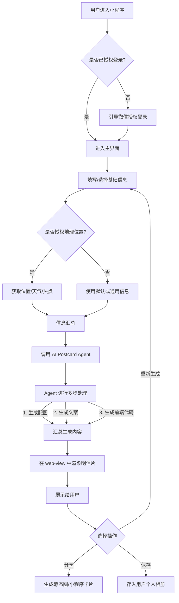

# AI 明信片小程序产品需求文档 (PRD) V1.0

## 1. 项目概述

"AI 明信片" 是一款基于微信小程序的创新应用。它旨在结合用户个人状态、实时环境信息（地理位置、天气、时事热点）以及 AI 的强大生成能力，为用户创造独一无二、充满个性与创意的电子明信片。项目核心亮点在于，利用 AI 不仅生成图片和文案，更直接生成前端代码来动态渲染整张明信片，提供超乎静态图片的丰富视觉体验。

### 1.1. 目标用户

- 追求个性化、希望用新颖方式记录和分享生活的年轻用户。
- 对 AIGC（AI Generated Content）技术感兴趣，乐于尝试新鲜事物的科技爱好者。
- 需要在特殊日子（如生日、节日、纪念日）发送创意祝福的用户。

### 1.2. 核心价值

- **极致个性化**: 每张明信片都是基于用户实时状态和环境独家定制，不可复制。
- **动态创意展现**: 超越传统图片，以代码生成动态、可交互的视觉效果，带来惊喜。
- **情感连接**: 作为一种新颖的社交货币，通过创意和科技连接情感，分享生活点滴。

---

## 2. 技术方案核心

- **渲染方案**: 采用**小程序 `web-view` 组件 + AI 生成的 HTML/CSS/JS** 模式。AI 负责生成标准的 Web 页面代码，由 `web-view` 在小程序内部加载并渲染，以实现最大的创意自由度和技术可行性。
- **后端服务**: 需要一个后端服务来处理 AI 调用、数据存储和用户管理。
- **数据持久化**: 所有生成的明信片内容及元数据都将存储在数据库中，为未来的社交功能（如好友动态）打下基础。

---

## 3. 功能需求详述

### 3.1. 用户流程 (User Flow)

### 3.2. AI 明信片生成引擎 (AI Postcard Agent)

这是项目的核心，一个具备 Tool-Using 能力的 AI 代理。

#### 3.2.1. 输入参数 (Inputs)

- **用户输入 (Required)**:
    - `mood`: 用户当前心情 (如：开心, 疲惫, 期待)。
    - `style`: 选择的艺术风格 (如：赛博朋克, 水墨国风, 像素艺术, 梵高, 极简主义)。
    - `theme`: 选择的内容主题 (如：旅行日记, 生活感悟, 节日祝福, 头脑风暴)。
- **用户输入 (Optional)**:
    - `name`: 用户昵称。
    - `occupation`: 用户职业。
- **环境上下文 (Contextual)**:
    - `location`: 地理位置 (需用户授权)。
    - `weather`: 实时天气 (基于 `location`)。
    - `date`: 当前日期。
    - `events`: 当日时事热点或节日信息 (通过网络搜索获取)。

#### 3.2.2. Agent 持有工具 (Tools)

Agent 必须能够调用以下工具来丰富生成内容：

- `getLocation()`: 调用小程序 API 获取用户经纬度。
- `getWeather(lat, lon)`: 调用天气 API 获取数据。
- `searchNews(query)`: 调用搜索引擎或新闻 API 获取热点。

#### 3.2.3. 输出结果 (Outputs)

Agent 单次执行后，需产出以下三项内容：

1.  **Image**: 一张 AI 生成的配图的 URL。
2.  **Copywriting**: 一段与主题和情境相符的文案。
3.  **Frontend Code**: 一个包含 `HTML`, `CSS` (可包含动画效果), 和可选的 `JavaScript` 的代码块，用于最终渲染。

### 3.3. 明信片渲染与展示

- 小程序前端获取到 AI 返回的 HTML 代码后，将其动态载入到页面的 `web-view` 组件中。
- `web-view` 区域应设计为卡片样式，模拟真实明信片的感觉。
- 应有加载状态（Loading...）的提示，提升用户体验。

### 3.4. 分享功能

用户在看到生成的明信片后，可以选择分享。

- **分享为图片**: 调用小程序截图功能，截取 `web-view` 内容区域，生成一张静态图片，用户可分享到朋友圈或发送给朋友。
- **分享为小程序卡片**: 使用微信标准分享功能，生成一个带有标题和缩略图的卡片。朋友点击后可直接进入此小程序。

### 3.5. 数据模型设计 (V1)

为了支持当前功能和未来扩展，需设计以下数据表。

- **Users**
    - `user_id` (Primary Key)
    - `open_id` (WeChat OpenID)
    - `nickname`
    - `avatar_url`
    - `created_at`

- **Postcards**
    - `postcard_id` (Primary Key)
    - `user_id` (Foreign Key to Users)
    - `image_url`
    - `copywriting_text`
    - `frontend_code`
    - `generation_params` (JSON, 存储生成该卡片的所有输入参数)
    - `created_at`

---

## 4. 里程碑规划 (Phased Development)

### 4.1. Phase 1: MVP (最小可行产品)

- **目标**: 实现核心的明信片生成与分享流程。
- **功能**:
    - [x] 微信授权登录。
    - [x] 用户基础信息输入界面。
    - [x] 实现完整的 AI Postcard Agent 调用逻辑。
    - [x] 实现 `web-view` 动态渲染。
    - [x] 实现分享为图片和分享为小程序卡片的功能。
    - [x] 完成基础的后端服务和数据库搭建。

### 4.2. Phase 2: 社交与探索

- **目标**: 增强产品的社交属性和可玩性。
- **功能**:
    - [ ] **好友明信片流**: 在一个专门的页面查看已连接微信好友公开发布的明信片。
    - [ ] **个人作品集**: 用户可以查看、管理自己生成过的所有明信片。
    - [ ] **主题和风格商店**: 引入更多、更独特的风格和主题供用户选择，甚至可以解锁。
    - [ ] **评论与点赞**: 为明信片增加简单的互动功能。 