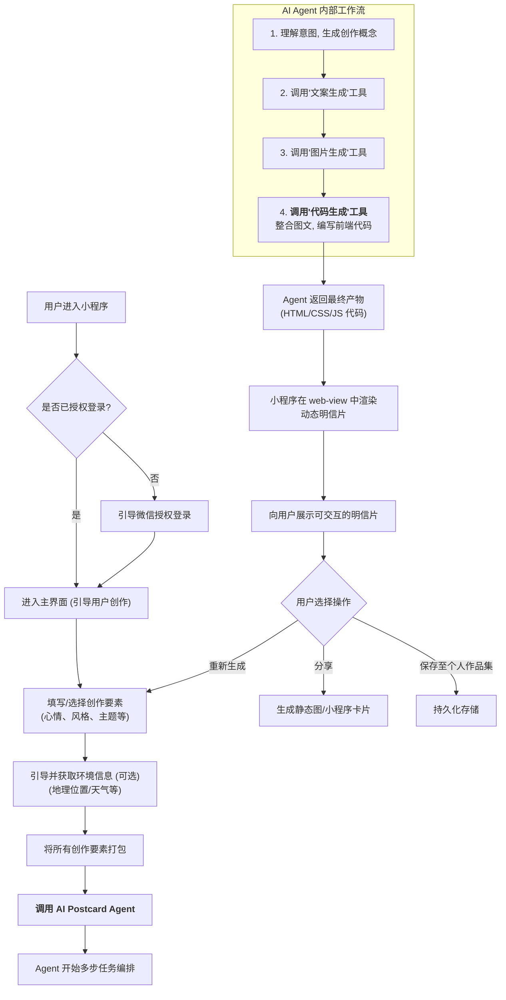

# AI 明信片小程序产品需求文档 (PRD) V2.0

## 1. 项目愿景与核心创新

### 1.1. 项目概述

"AI 明信片" 是一款基于微信小程序的超个性化内容创作与分享应用。它旨在颠覆传统的静态内容生成模式，通过一个多步骤的 AI 代理（Agent），将用户的实时状态、环境信息与多模态 AI 的能力深度融合。

### 1.2. 核心创新：AI 实时前端编码

本项目**最核心的创新亮点**在于，AI 不仅仅是内容的“创作者”，更是最终呈现形式的**“前端工程师”**。

传统 AIGC 应用止步于生成图片或文本，而“AI 明信片”将这两者作为素材，驱动第三个、也是最关键的 AI——**代码生成模型**，来实时编写**可交互、带动画、风格化**的前端代码 (`HTML/CSS/JS`)。

最终交付给用户的不是一张静态图片，而是一个**动态的、独一无二的、由 AI 亲自编码实现的微型网页应用**，并在小程序内的 `web-view` 组件中渲染出来。这为用户提供了前所未有的、充满惊喜的创意体验。

### 1.3. 目标用户

- 追求极致个性化、希望用新颖方式记录和分享生活的年轻用户。
- 对 AIGC 和 AI Agent 技术感兴趣，乐于尝试前沿科技的探索者。
- 需要在特殊日子（如生日、节日、纪念日）发送创意祝福，寻求独特表达方式的用户。

---

## 2. 功能需求详述

### 2.1. 整体用户流程 (User Flow)

### 2.2. AI 明信片生成引擎 (AI Postcard Agent)

这是项目的技术核心，一个负责任务编排和工具调用的 AI 代理。

#### 2.2.1. 输入参数 (Inputs)

- **用户显式输入 (Required)**:
    - `mood`: 用户当前心情 (如：开心, 疲惫, 期待)。
    - `style`: 期望的艺术风格 (如：赛博朋克, 水墨国风, 像素艺术, 梵高, 极简主义)。
    - `theme`: 核心内容主题 (如：旅行日记, 生活感悟, 节日祝福, 头脑风暴)。
- **用户个人信息 (Optional)**:
    - `name`: 用户昵称。
    - `occupation`: 用户职业。
- **环境上下文 (Contextual, Optional)**:
    - `location`: 地理位置 (需用户授权)。
    - `weather`: 实时天气 (基于 `location`)。
    - `date`: 当前日期。
    - `events`: 当日时事热点或节日信息 (通过后端网络搜索获取)。

#### 2.2.2. Agent 的内部工作流与工具集 (Workflow & Tools)

Agent 接收到请求后，将按序执行以下步骤，每一步都可能调用一个或多个外部 AI API (即“工具”)。

1.  **[Tool: Text Generation API] - 概念生成**: 综合所有输入，生成一个核心的创作概念或故事板 (Storyboard)。
2.  **[Tool: Text Generation API] - 文案生成**: 基于概念，创作符合主题和情感的文案。
3.  **[Tool: Image Generation API] - 图像生成**: 基于概念和风格，生成一张视觉配图，并将其上传至对象存储，获取一个永久 URL。
4.  **[Tool: Code Generation API] - 前端编码**: 这是**最关键的一步**。Agent 将调用代码生成模型（如 Claude, Gemini Pro），并下达一个精心设计的 Prompt，指令其：
    -   使用上一步获取的 `image_url` 作为背景或元素。
    -   将生成的文案整合到页面中。
    -   根据用户选择的 `style` 和 `theme`，编写带有**动画效果**和**交互元素**的 `HTML/CSS/JS` 代码。
    -   确保代码是**独立、完整、可直接在 `web-view` 中运行的**。
5.  **结果汇总**: 将生成的 `frontend_code` 及其他元数据（如图片URL、文案原文）打包，作为最终结果返回。

#### 2.2.3. 输出结果 (Outputs)

Agent 单次执行后，需产出一个包含以下核心字段的 JSON 对象：

- `frontend_code`: 包含 `HTML`, `CSS`, `JavaScript` 的完整代码字符串。**这是渲染的核心**。
- `image_url`: AI 生成的配图的 URL。
- `copywriting_text`: AI 生成的文案原文。
- `generation_params`: (JSON) 存储生成该卡片的所有输入参数，用于复现和分析。

### 2.3. 明信片渲染与分享

- **渲染**: 小程序前端获取到 `frontend_code` 后，将其动态载入到页面的 `web-view` 组件中。`web-view` 应设计为卡片样式，并有加载提示。
- **分享**: 用户可将 `web-view` 内容截图，分享为静态图片；或通过小程序标准方式分享卡片。

---

## 3. 数据模型设计 (V2)

- **Users**
    - `user_id` (Primary Key), `open_id`, `nickname`, `avatar_url`, `created_at`
- **Postcards**
    - `postcard_id` (Primary Key)
    - `user_id` (Foreign Key)
    - `frontend_code` (TEXT, NOT NULL): **存储由 AI 生成的、用于渲染的完整前端代码**。
    - `image_url` (VARCHAR): 原始图片素材的URL。
    - `copywriting_text` (TEXT): 原始文案素材。
    - `generation_params` (JSON): 生成该卡片的所有输入参数。
    - `created_at`

---

## 4. 里程碑规划 (Phased Development)

### 4.1. Phase 1: MVP (核心功能闭环)

- **目标**: 实现以“AI实时编码”为核心的明信片生成与分享流程。
- **核心功能**:
    - [ ] 微信授权登录。
    - [ ] 用户创作要素输入界面。
    - [ ] **完成 AI Postcard Agent 的完整多步工作流（文案 -> 图片 -> 前端代码）**。
    - [ ] **实现 `web-view` 动态渲染 AI 生成的代码**。
    - [ ] 实现分享为图片和分享为小程序卡片的功能。
    - [ ] 完成支持该流程的后端服务和数据库搭建。

### 4.2. Phase 2: 社交与探索

- **目标**: 增强产品的社交属性和可玩性。
- **功能**:
    - [ ] **好友明信片流**: 查看好友公开发布的**动态**明信片。
    - [ ] **个人作品集**: 管理自己生成过的所有**动态**明信片。
    - [ ] **主题和风格商店**: 引入更多、更独特的生成风格和主题。
    - [ ] **互动功能**: 为明信片增加评论与点赞。 